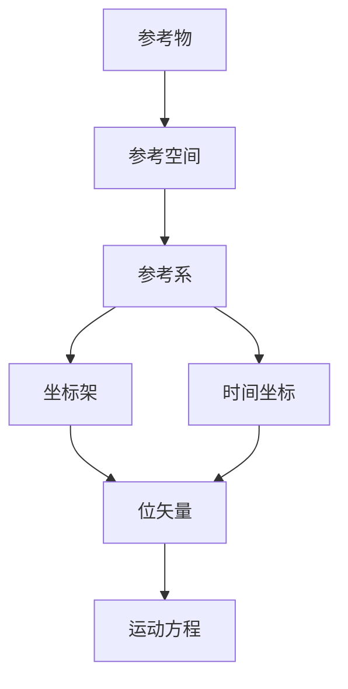

# [[参考物、坐标和坐标系]]

> 代数学的基础
> 空间坐标系：量化的参考空间，标定空间位置
> 时间坐标系：标定时间

#物理学 #数学 

----

## 定义

### 1.参考物（Reference Object）
一个物体的某个点部位只有相对另一个物体（或者该物体的另一个部分），其位置才有确切的意义，这一另一物体即**参考物**。
- 必须为可以观测的实体

### 2.参考空间（Reference Space）和参考系（Reference Frame）
无论参考物的大小如何（但不能为~~一个点~~，因为没有体结构），将其沿人为定义的左右、前后、上下3对（6个）方向无限延伸，构成三维空间，这一空间即成为**参考空间**。
$$
\mathbb{R}^3 \text{ with metric } ds^2 = dx^2 + dy^2 + dz^2
$$
- 参考物体必须是刚体（其内任何两个部分之间保持相对位置不变）或模块化为刚性物体，因为参考物与之对应的参考空间之间必须处处相对静止，因此参考物理论上不~~可以有形变~~
- 各向同性且均匀（默认的欧几里得空间）
- 可拓展到非惯性空间（如旋转参考系中的虚拟力）
### 3.时间坐标（Time Coordinate）
时间的度量值记为$t$，独立存在

- 描述事件发生的时序，满足：
$$
  t \in \mathbb{R}, \quad \Delta t \text{与时钟精度相关}
$$

- 和空间坐标系塞在一起才有意义
- 绝对时间（牛顿力学）vs 相对时间（[[相对论]]）
- 同步性问题（见[[同时的相对性]]）

### 4.坐标（Coordinates）和位矢（Position Vector）
参考系中的一个物体的任意一点部位均可以用相对坐标原点的**位置矢量**（位矢）$\vec{r}$ 表述。
- 非绝对量
- 某个坐标系下一个点位矢的数学表示就是其坐标。

## 常见的坐标系

| 坐标系     | 分量                |
| ------- | ----------------- |
| 平面直角坐标系 | $(x,y)$           |
| 平面极坐标系  | $(\rho, \theta)$  |
| 空间直角坐标系 | $(x,y,z)$         |
| 柱坐标系    | $(\rho,\theta,z)$ |
| 球面坐标系   | $(r,\theta,\psi)$ |

及其互化：
平面直角坐标系和极坐标系：
$$
\rho=\sqrt{x^2+y^2}, \quad x=\rho \cos \theta, \quad y=\rho \sin \theta
$$
空间直角坐标系和柱坐标系、球面坐标系：
$$
\rho = \sqrt{{x_z}^2+{y_z}^2}
$$
### 惯性系和非惯性系

### **例题说明**
**题目**：以旋转圆盘为参考系，分析边缘质点的位矢变化。

**解答步骤**：
1. 建立非惯性系：极坐标$(r,\theta)$，角速度$\omega$
2. 位矢表达：
$$
   \vec{r} = r\hat{r}(t), \quad \hat{r}(t) = \cos(\omega t)\hat{i} + \sin(\omega t)\hat{j}
$$
3. 速度/加速度含科里奥利项（体现非惯性系特性）

## 可视化建议

扩展链接

## 参考内容
[[力学_物理类2th_舒幼生]]