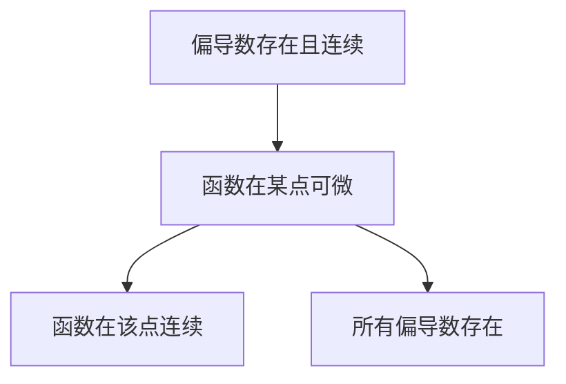

> 从狭隘的左右逼近到无限路径逼近

#数学

---

## 定义与几何表示

- **n 维点集**：$\mathbf{x}=(x_1,...,x_n) \in \mathbb{R}^n$
- **二元函数可视化**：
  - 等值线图：$f(x,y)=c$（地形图中的等高线）
  - 三维曲面：$z=f(x,y)$（如马鞍面$z=x^2-y^2$）

---

## 派生概念的基本定义

### 1. 函数在某点连续

设函数 $f(x_1, x_2, \dots, x_n)$ 在点 $\mathbf{a} = (a_1, a_2, \dots, a_n)$ 的**某邻域内**有定义。  
若：

$$
\lim_{\mathbf{x} \to \mathbf{a}} f(\mathbf{x}) = f(\mathbf{a}),
$$

则称 $f$ 在 $\mathbf{a}$ 处连续。

---

### 2. 偏导数存在

设函数 $f(x_1, x_2, \dots, x_n)$ 在点 $\mathbf{a}$ 的**某邻域内**（所以，仅在某个点是不够的，一定是一个无穷小的面上）有定义。  
对第 $i$ 个变量 $x_i$ 的偏导数定义为：

$$
\frac{\partial f}{\partial x_i}(\mathbf{a}) = \lim_{h \to 0} \frac{f(a_1, \dots, a_i + h, \dots, a_n) - f(\mathbf{a})}{h}.
$$

若该极限存在，则称 $f$ 在 $\mathbf{a}$ 处对 $x_i$ 的偏导数存在。

---

### 3. 偏导数连续

若所有偏导数 $\frac{\partial f}{\partial x_i}$ 在点 $\mathbf{a}$ 的**某邻域内**存在且连续，则称 $f$ 在 $\mathbf{a}$ 处偏导连续（即 $f \in C^1$ 类函数）。

---

### 4. 函数在某点可微

设函数 $f(x_1, x_2, \dots, x_n)$ 在点 $\mathbf{a}$ 的**某邻域**内有定义。  
若存在常数 $A_1, A_2, \dots, A_n$，使得：

$$
f(\mathbf{a} + \Delta \mathbf{x}) - f(\mathbf{a}) = \sum_{i=1}^n A_i \Delta x_i + o(\|\Delta \mathbf{x}\|),
$$

其中 $\Delta \mathbf{x} = (\Delta x_1, \Delta x_2, \dots, \Delta x_n)$，且 $\|\Delta \mathbf{x}\| \to 0$，则称 $f$ 在 $\mathbf{a}$ 处可微。

此时，称 $df(\mathbf{a}) = \sum_{i=1}^n A_i dx_i$ 为全微分，且 $A_i = \frac{\partial f}{\partial x_i}(\mathbf{a})$。

> 二元函数可微的几何意义是，在某点存在一个不不平行于$z$轴的面和这个点相切

---

### 5. 全微分

#### 核心定义

| 概念   | 数学表达                                                                                             | 物理对应                                                 |
| ------ | ---------------------------------------------------------------------------------------------------- | -------------------------------------------------------- |
| 偏导数 | $\frac{\partial f}{\partial x_i} = \lim_{h\to0}\dfrac{f(\mathbf{x}+h\mathbf{e}_i)-f(\mathbf{x})}{h}$ | 方向响应（如热流方向导数）                               |
| 全微分 | $df = \sum_{i=1}^n \frac{\partial f}{\partial x_i}dx_i$                                              | 微小变化量（如功的计算$dW=\mathbf{F}\cdot d\mathbf{r}$） |

#### 几何解释

- 偏导数：**曲面与坐标平面交线的斜率**
- 全微分：切平面方程$z-z_0=f_x(x_0,y_0)(x-x_0)+f_y(x_0,y_0)(y-y_0)$

#### 全微分必要条件

> 如果函数$z=f(x,y)$在点$(x,y)$可微分，那么该函数在点$(x,y)$的偏导数$\dfrac{\partial z}{\partial x}$和$\dfrac{\partial z}{\partial y}$必然存在，且函数$z=f(x,y)$在点$(x,y)$的全微分为：$$dz=\dfrac{\partial z}{\partial x}\Delta x+\dfrac{\partial z}{\partial y}\Delta y$$

- 各偏导数的存在只是全微分存在的必要条件
- 只有确定在这个点可微的时候，才可以把$dz$写成上式的这个样子，不然要用定义求导

#### 全微分充分条件

> 如果函数$z=f(x,y)$的偏导数$\dfrac{\partial z}{\partial x}$和$\dfrac{\partial z}{\partial y}$在点$(x,y)$的连续，那么函数在该点可微分。

---

### 6. 方向导数和梯度

- **方向导数**：
  $$ D\_{\mathbf{u}}f = \nabla f \cdot \mathbf{u} = \|\nabla f\|\cos\theta$$
- **梯度性质**：
  - 指向函数**增长**最快方向
  - 等值面的法向量（如电场$\mathbf{E}=-\nabla V$）

#### **典型计算**

求$f(x,y)=x^2y$在点$(1,2)$沿$\mathbf{v}=(3,4)$的方向导数：

1. 归一化：$\mathbf{u}=(\frac{3}{5},\frac{4}{5})$
2. 计算梯度：$\nabla f=(2xy,x^2)\big|_{(1,2)}=(4,1)$
3. 点积：$D_{\mathbf{u}}f=4\cdot\frac{3}{5}+1\cdot\frac{4}{5}=\frac{16}{5}$

---

## 概念之间的关系

### 1. **可微性与连续性**

- **可微 ⇒ 连续**  
  若函数在某点可微，则它在该点必连续。
- **连续 ⇏ 可微**  
  连续不~~一定可微~~（例如 $f(x,y) = |x| + |y|$ 在原点**连续但不可微**，其在原点实际上是一个尖角，只有一个点）。

---

### 2. **可微性与偏导数存在性**

- **可微 ⇒ 偏导数存在**  
  若函数在某点可微，则所有偏导数在该点存在。
- **偏导数存在 ⇏ 可微**  
  偏导数存在不足以保证可微（例如 $f(x,y) = \dfrac{x^2 y}{x^4 + y^2}$ 在原点偏导存在但不可微）。

---

### 3. **偏导数连续性与可微性**

- **偏导数连续 ⇒ 可微**  
  若所有偏导数在某点的邻域内存在且连续（即 $f \in C^1$），则函数在该点可微。
- **可微 ⇏ 偏导数连续**  
  可微函数的偏导数可能不连续（例如 $f(x,y) = (x^2 + y^2)\sin\left(\dfrac{1}{\sqrt{x^2 + y^2}}\right)$ 在原点可微但偏导不连续）。

---

## 性质推导

## 常见反例

### 1. 连续但不可微

$$
f(x,y) = |x| + |y|, \quad \text{在原点连续但不可微}
$$

### 2. 偏导存在但不可微

$$
f(x,y) =
\begin{cases}
\dfrac{x^2 y}{x^4 + y^2}, & (x,y) \neq (0,0) \\
0, & (x,y) = (0,0)
\end{cases}, \quad \text{在原点偏导存在但不可微}
$$
$$
f(x,y) =
\begin{cases}
\dfrac{xy}{\sqrt{x^2+y^2}}, & (x,y) \neq (0,0) \\
0, & (x,y) = (0,0)
\end{cases}, \quad \text{在原点偏导存在但不可微}
$$

### 3. 可微但偏导不连续

$$
f(x,y) =
\begin{cases}
(x^2 + y^2)\sin\left(\dfrac{1}{\sqrt{x^2 + y^2}}\right), & (x,y) \neq (0,0) \\
0, & (x,y) = (0,0)
\end{cases}, \quad \text{在原点可微但偏导不连续}
$$

---

## 做题方法

## 复合函数求导的链式法则：画图

- 求导后不改变其原始自变量个数
- 分段现乘，分叉相加，单路全导，多路偏导

#### **核心公式**

- 单变量链式：$$\frac{dz}{dt}=\frac{\partial z}{\partial x}\frac{dx}{dt}+\frac{\partial z}{\partial y}\frac{dy}{dt}$$
- 多变量链式：
  $$\dfrac{\partial z}{\partial u} = \dfrac{\partial z}{\partial x}\dfrac{\partial x}{\partial u} + \dfrac{\partial z}{\partial y}\dfrac{\partial y}{\partial u}$$
- 全微分形式不变性
- 隐函数求导

---

### 多元函数极值

#### 判别方法

1. 找驻点：解$\nabla f=0$
2. 黑塞矩阵判定：
   $$
   H = \begin{bmatrix}
   f_{xx} & f_{xy} \\
   f_{yx} & f_{yy}
   \end{bmatrix}
   $$
   - $det(H)>0$且$f_{xx}>0$ → 极小值
   - $det(H)>0$且$f_{xx}<0$ → 极大值
   - $det(H)<0$ → 鞍点

#### **拉格朗日乘数法**

约束优化问题：
$$\mathcal{L}(x,y,\lambda) = f(x,y) - \lambda g(x,y)$$
物理应用：约束系统平衡条件（如悬链线问题）

---

## 参考资料

| 教材名称                                | 作者             | 相关章节                                  |
| --------------------------------------- | ---------------- | ----------------------------------------- |
| 《高等数学》                            | 同济大学         | 第九章：多元函数微分学                    |
| 《数学分析（上、下）》                  | 陈纪修           | 第八章：多元函数微分学                    |
| 《Thomas' Calculus》                    | George B. Thomas | Chapter 14: Partial Derivatives           |
| 《Calculus on Manifolds》               | Michael Spivak   | Chapter 2: Differentiation                |
| 《Principles of Mathematical Analysis》 | Walter Rudin     | Chapter 9: Functions of Several Variables |
