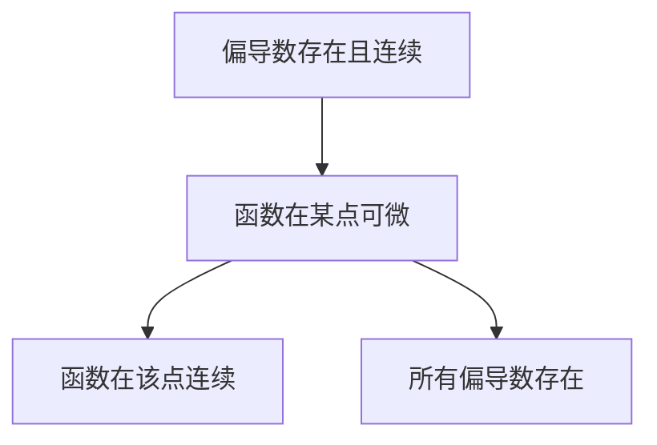
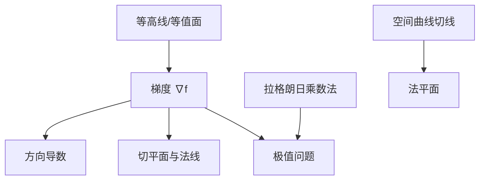

> 从狭隘的左右逼近到无限路径逼近

#数学

---

## 定义与几何表示

- **n 维点集**：$\mathbf{x}=(x_1,...,x_n) \in \mathbb{R}^n$
- **二元函数可视化**：
  - 等值线图：$f(x,y)=c$（地形图中的等高线）
  - 三维曲面：$z=f(x,y)$（如马鞍面$z=x^2-y^2$）

---

## 派生概念的基本定义

### 1. 函数在某点连续

设函数 $f(x_1, x_2, \dots, x_n)$ 在点 $\mathbf{a} = (a_1, a_2, \dots, a_n)$ 的**某邻域内**有定义。  
若：

$$
\lim_{\mathbf{x} \to \mathbf{a}} f(\mathbf{x}) = f(\mathbf{a}),
$$

则称 $f$ 在 $\mathbf{a}$ 处连续。

---

### 2. 偏导数存在

设函数 $f(x_1, x_2, \dots, x_n)$ 在点 $\mathbf{a}$ 的**某邻域内**（所以，仅在某个点是不够的，一定是一个无穷小的面上）有定义。  
对第 $i$ 个变量 $x_i$ 的偏导数定义为：

$$
\frac{\partial f}{\partial x_i}(\mathbf{a}) = \lim_{h \to 0} \frac{f(a_1, \dots, a_i + h, \dots, a_n) - f(\mathbf{a})}{h}.
$$

若该极限存在，则称 $f$ 在 $\mathbf{a}$ 处对 $x_i$ 的偏导数存在。

- 如果在此点在**连续区间内**，可以直接公式法求导，如果算出来的不是常数，就不存在

---

### 3. 偏导数连续

若所有偏导数 $\frac{\partial f}{\partial x_i}$ 在点 $\mathbf{a}$ 的**某邻域内**存在且连续，则称 $f$ 在 $\mathbf{a}$ 处偏导连续（即 $f \in C^1$ 类函数）。

---

### 4. 函数在某点可微

设函数 $f(x_1, x_2, \dots, x_n)$ 在点 $\mathbf{a}$ 的**某邻域**内有定义。  
若存在常数 $A_1, A_2, \dots, A_n$，使得：

$$
f(\mathbf{a} + \Delta \mathbf{x}) - f(\mathbf{a}) = \sum_{i=1}^n A_i \Delta x_i + o(\|\Delta \mathbf{x}\|),
$$

其中 $\Delta \mathbf{x} = (\Delta x_1, \Delta x_2, \dots, \Delta x_n)$，且 $\|\Delta \mathbf{x}\| \to 0$，则称 $f$ 在 $\mathbf{a}$ 处可微。

此时，称 $df(\mathbf{a}) = \sum_{i=1}^n A_i dx_i$ 为全微分，且 $A_i = \frac{\partial f}{\partial x_i}(\mathbf{a})$。

> 二元函数可微的几何意义是，在某点存在一个**不平行于$z$轴的面**和这个点所在的无穷小的面相切

---

### 5. 全微分

#### 核心定义

| 概念   | 数学表达                                                                                              | 物理对应                                                 |
| ------ | ----------------------------------------------------------------------------------------------------- | -------------------------------------------------------- |
| 偏导数 | $\dfrac{\partial f}{\partial x_i} = \lim_{h\to0}\dfrac{f(\mathbf{x}+h\mathbf{e}_i)-f(\mathbf{x})}{h}$ | 方向响应（如热流方向导数）                               |
| 全微分 | $df = \sum_{i=1}^n \dfrac{\partial f}{\partial x_i}dx_i$                                              | 微小变化量（如功的计算$dW=\mathbf{F}\cdot d\mathbf{r}$） |

#### 几何解释

- 偏导数：**曲面与坐标平面交线的斜率**
- 全微分：切平面方程$z-z_0=f_x(x_0,y_0)(x-x_0)+f_y(x_0,y_0)(y-y_0)$

#### 全微分必要条件

> 如果函数$z=f(x,y)$在点$(x,y)$可微分，那么该函数在点$(x,y)$的偏导数$\dfrac{\partial z}{\partial x}$和$\dfrac{\partial z}{\partial y}$必然存在，且函数$z=f(x,y)$在点$(x,y)$的全微分为：$$dz=\dfrac{\partial z}{\partial x}\Delta x+\dfrac{\partial z}{\partial y}\Delta y$$

- **各偏导数的存在只是全微分存在的必要条件**
- 只有确定在这个点可微的时候，才可以把$dz$写成上式的这个样子，**不然要用定义求导**

#### 全微分充分条件

> 如果函数$z=f(x,y)$的偏导数$\dfrac{\partial z}{\partial x}$和$\dfrac{\partial z}{\partial y}$在点$(x,y)$的连续，那么函数在该点可微分。

---

## 概念之间的关系

### 1. **可微性与连续性**

- **可微 ⇒ 连续**  
  若函数在某点可微，则它在该点必连续。
- **连续 ⇏ 可微**  
  连续不~~一定可微~~（例如 $f(x,y) = |x| + |y|$ 在原点**连续但不可微**，其在原点实际上是一个尖角，只有一个点）。

---

### 2. **可微性与偏导数存在性**

- **可微 ⇒ 偏导数存在**  
  若函数在某点可微，则所有偏导数在该点存在。
- **偏导数存在 ⇏ 可微**  
  偏导数存在不足以保证可微（例如 $f(x,y) = \dfrac{x^2 y}{x^4 + y^2}$ 在原点偏导存在但不可微）。

---

### 3. **偏导数连续性与可微性**

- **偏导数连续 ⇒ 可微**  
  若所有偏导数在某点的邻域内存在且连续（即 $f \in C^1$），则函数在该点可微。
- **可微 ⇏ 偏导数连续**  
  可微函数的偏导数可能不连续（例如 $f(x,y) = (x^2 + y^2)\sin\left(\dfrac{1}{\sqrt{x^2 + y^2}}\right)$ 在原点可微但偏导不连续）。

---

## 性质推导



## 常见反例

### 1. 连续但不可微

$$
f(x,y) = |x| + |y|, \quad \text{在原点连续但不可微}
$$

### 2. 偏导存在但不可微

$$
f(x,y) =
\begin{cases}
\dfrac{x^2 y}{x^4 + y^2}, & (x,y) \neq (0,0) \\
0, & (x,y) = (0,0)
\end{cases}, \quad \text{在原点偏导存在但不可微}
$$

$$
f(x,y) =
\begin{cases}
\dfrac{xy}{\sqrt{x^2+y^2}}, & (x,y) \neq (0,0) \\
0, & (x,y) = (0,0)
\end{cases}, \quad \text{在原点偏导存在但不可微}
$$

### 3. 可微但偏导不连续

$$
f(x,y) =
\begin{cases}
(x^2 + y^2)\sin\left(\dfrac{1}{\sqrt{x^2 + y^2}}\right), & (x,y) \neq (0,0) \\
0, & (x,y) = (0,0)
\end{cases}, \quad \text{在原点可微但偏导不连续}
$$

---

## 做题方法

### 复合函数求导的链式法则：画图

- 求导后不改变其原始自变量个数
- 分段现乘，分叉相加，单路全导，多路偏导

## 核心公式

- 单变量链式：$$\frac{dz}{dt}=\frac{\partial z}{\partial x}\frac{dx}{dt}+\frac{\partial z}{\partial y}\frac{dy}{dt}$$
- 多变量链式：
  $$\dfrac{\partial z}{\partial u} = \dfrac{\partial z}{\partial x}\dfrac{\partial x}{\partial u} + \dfrac{\partial z}{\partial y}\dfrac{\partial y}{\partial u}$$
- 全微分形式不变性:$$\dfrac{\partial z}{\partial x \partial y}=\dfrac{\partial z}{\partial y \partial x}$$
- 隐函数求导

---

### 多元函数极值（Extreme Value Problems）

#### 1. 无约束极值

1. **临界点/驻点**：满足 $\nabla f = 0$ 的点。
2. 黑塞（Hessian）矩阵判定：
   $$
   H = \begin{bmatrix}
   f_{xx} & f_{xy} \\
   f_{yx} & f_{yy}
   \end{bmatrix} = \begin{bmatrix}
   A & B \\
   B & C
   \end{bmatrix}
   $$
   - $det(H)>0$且$f_{xx}>0$ → 极小值
   - $det(H)>0$且$f_{xx}<0$ → 极大值
   - $det(H)<0$ → 鞍点
   - $det(H)=0$ → 另外判别

#### 2. 拉格朗日乘数法

约束优化问题：
$$\mathcal{L}(x,y,\lambda) = f(x,y) - \lambda g(x,y)$$求解：

$$
\nabla \mathcal{L} = 0 \Rightarrow \nabla f = \lambda \nabla g
$$

- 如果有多个极值条件，可以多加几个参数。这些参数的值并不重要，只要能把 xyz 算出来就行
- 物理应用：约束系统平衡条件（如悬链线问题）

---

## 几何应用

### 一、梯度（Gradient）与方向导数（Directional Derivative）

#### 1. [[梯度]]

设 $f(x,y,z)$ 在某区域内**可微**，则其梯度为：

$$
\nabla f = \left( \frac{\partial f}{\partial x}, \frac{\partial f}{\partial y}, \frac{\partial f}{\partial z} \right)
$$

- 几何意义：梯度方向是**函数增长最快的方向**，其大小为**最大方向导数**
- 与等高线/等值面的关系：梯度垂直于等高线（二维）或等值面（三维）
- 梯度是一个**向量**

#### 2. 方向导数

在单位向量 $\vec{u} = (a,b,c)$ 方向上的方向导数为：

$$
D_{\vec{u}} f = \nabla f \cdot \vec{u} = \|\nabla f\|\cos\theta
$$

- 几何意义：函数在方向 $\vec{u}$ 上的变化率
- 方向导数是个**数**
- 对于不连续点需要直接根据定义计算

#### 典型计算

求$f(x,y)=x^2y$在点$(1,2)$沿$\mathbf{v}=(3,4)$的方向导数：

1. 归一化：$\mathbf{u}=(\frac{3}{5},\frac{4}{5})$
2. 计算梯度：$\nabla f=(2xy,x^2)\big|_{(1,2)}=(4,1)$
3. 点积：$D_{\mathbf{u}}f=4\cdot\frac{3}{5}+1\cdot\frac{4}{5}=\frac{16}{5}$

---

### 二、等高线与梯度场（Level Curves/Surfaces & Gradient Field）

#### 1. 等高线（Level Curve）

对于 $f(x,y) = C$，其梯度 $\nabla f$ 垂直于该等高线。

#### 2. 等值面（Level Surface）

对于 $f(x,y,z) = C$，其梯度 $\nabla f$ 是该等值面的法向量。

#### 3. 梯度场图示

```mermaid
graph TD
    A[等高线 f(x,y)=C] --> B[梯度方向垂直于等高线]
    C[梯度场 ∇f(x,y)] --> D[箭头方向表示最大增长方向]
```

---

### 三、曲面的切平面与法线（Tangent Plane & Normal Line）

#### 1. 曲面的切平面

设曲面由 $F(x,y,z) = 0$ 定义，点 $P(x_0,y_0,z_0)$ 在曲面上，则切平面方程为：

$$
\frac{\partial F}{\partial x}(P)(x - x_0) + \frac{\partial F}{\partial y}(P)(y - y_0) + \frac{\partial F}{\partial z}(P)(z - z_0) = 0
$$

- 法向量：$\nabla F(P)$

#### 2. 曲面的法线

曲面上一点$(x_0,y_0,z_0)$法线方程为：

$$
\dfrac{x - x_0}{\dfrac{\partial F}{\partial x}(P)} = \dfrac{y - y_0}{\dfrac{\partial F}{\partial y}(P)} = \dfrac{z - z_0}{\dfrac{\partial F}{\partial z}(P)}
$$

#### 3. 显式曲面的切平面

若曲面为 $z = f(x,y)$，则切平面方程为：

$$
z = f(x_0,y_0) + \dfrac{\partial f}{\partial x}(x_0,y_0)(x - x_0) + \dfrac{\partial f}{\partial y}(x_0,y_0)(y - y_0)
$$

---

### 四、[[空间直线、平面和曲线、曲面的方程|空间曲线]]的切线与法平面（Tangent Line & Normal Plane）

#### 1. 参数化曲线的切线

设曲线由 $\vec{r}(t) = (x(t), y(t), z(t))$ 定义，则在点 $t_0$ 处的切向量为：

$$
\vec{r}'(t_0) = \left( x'(t_0), y'(t_0), z'(t_0) \right)
$$

切线方程为：

$$
\frac{x - x_0}{x'(t_0)} = \frac{y - y_0}{y'(t_0)} = \frac{z - z_0}{z'(t_0)}
$$

如果看不出来怎么办：当曲线 $\Gamma=\begin{cases}F(x,y,z)=0\\H(x,y,z)=0\end{cases}$ 确定时：

- 首先我们知道任何一条空间曲线都是由两个面相交得到的，这两个面（应该都是在某点可微的），在存在法向量$\vec{n_{1}},\vec{n_{2}}$
- 所以：$\vec{n_{1}} = (F_{x},F_{y},F_{z}),\quad \vec{n_{2}}=(H_{x},H_{y},H_{z})$
- 带入具体点$P(x_{0},y_{0},z_{0}):\vec{n_{1}}|_{P}, \quad \vec{n_{2}}|_{P}$
- 此点处切向量垂直于两个法向量，于是：$$\overrightarrow{r_{P}}=\vec{n_{1}}|_{P} \times \vec{n_{2}}|_{P}$$
- 顺带回顾一下一点$P_0$到直线$l$的距离（点$P\in l$）：$$\boxed{d=\frac{\lvert \overrightarrow{PP_{0}} \times \overrightarrow{r} \rvert}{\lvert \vec{r} \rvert}}$$

#### 2. 法平面

法平面方程为：

$$
x'(t_0)(x - x_0) + y'(t_0)(y - y_0) + z'(t_0)(z - z_0) = 0
$$

---

### 几何应用例题

#### 1. 求[[曲面]]在某点的切平面

**例题**：求曲面 $z = x^2 + y^2$ 在点 $(1,1,2)$ 处的切平面。
**解**：
$$F(x,y,z)=x^2+y^2-z$$  
$$\dfrac{\partial F}{\partial x}=2x,\quad\dfrac{\partial F}{\partial y}=2y, \quad\dfrac{\partial F}{\partial z}=-1$$

- 梯度：$\nabla f = (2x, 2y, -1)$
- 代入点 $(1,1,2)$，得法向量 $\vec{n} = (2, 2, -1)$
- 切平面方程：$2(x-1) + 2(y-1) - (z-2) = 0$

#### 2. 求函数在某方向的方向导数

**例题1**：求 $f(x,y) = x^2 + y^2$ 在点 $(1,1)$ 沿方向 $\vec{u} = (\dfrac{1}{\sqrt{2}}, \dfrac{1}{\sqrt{2}})$ 的方向导数。
**解**：

- 梯度：$\nabla f = (2x, 2y) = (2, 2)$
- 方向导数：$D_{\vec{u}} f = (2,2) \cdot (\dfrac{1}{\sqrt{2}}, \dfrac{1}{\sqrt{2}}) = \dfrac{4}{\sqrt{2}} = 2\sqrt{2}$

**例题2：**
设函数$f ( x, y )=\left\{\begin{aligned} {{}} & {{} {{} {{} x-y^{2}+\frac{y^{3} x \sin x} {x^{2}+y^{4}}, \quad}}} & {{}} & {{{} {{} ( x, y ) \neq( 0, 0 ),}}} \\ {{}} & {{} {{} {{} 0, \quad}}} & {{{}}} & {{{{} {} ( x, y )=( 0, 0 ).}}} \\ \end{aligned} \right.$
(1）求$f(x,y)$在$(0,0)$处沿方向 $l=( \cos \theta, \sin \theta)$ 的方向导数 $\dfrac{\partial f} {\partial l} ( 0, 0 )$;
(2）判断$f(x,y)$在$(0, 0)$处是否可微，并说明理由

解：
--

（1）由方向导数的定义可知

$$\begin{aligned}
\frac{\partial f}{\partial \boldsymbol{l}}(0, 0) &= \lim_{t \to 0^+} \frac{f(t \cos \theta, t \sin \theta) - f(0, 0)}{t} \\
&= \lim_{t \to 0^+} \frac{t \cos \theta - t^2 \sin^2 \theta + \frac{t^4 \cos \theta \sin^3 \theta \sin t \cos \theta}{t^2 \cos^2 \theta + t^4 \sin^4 \theta}}{t} \\
&= \lim_{t \to 0^+} \left( \cos \theta - t \sin^2 \theta + t \cdot \frac{\cos \theta \sin^3 \theta \sin t \cos \theta}{\cos^2 \theta + t^2 \sin^4 \theta} \right) \\
&= \lim_{t \to 0^+} \left( \cos \theta - t \sin^2 \theta + \frac{t^2 \cos^2 \theta \sin^3 \theta}{\cos^2 \theta + t^2 \sin^4 \theta} \right).
\end{aligned}$$

又因为
$$
\begin{aligned}
\left| \frac{t^2 \cos^2 \theta \sin^3 \theta}{\cos^2 \theta + t^2 \sin^4 \theta} \right| &= \frac{1}{2} |t \cos \theta \sin \theta| \left| \frac{2t \cos \theta \sin^2 \theta}{\cos^2 \theta + t^2 \sin^4 \theta} \right| \\
&\leq \frac{1}{4} |t \sin 2\theta| \to 0,
\end{aligned}
$$
所以

$$\frac{{\partial f}}{{\partial \boldsymbol{l}}}(0, 0) = \cos \theta.$$

（2）先求 $(0, 0)$ 处的偏导数：
$$
\begin{aligned}
f_x(0, 0) &= \lim_{x \to 0} \frac{f(x, 0) - f(0, 0)}{x} = \lim_{x \to 0} \frac{x - 0}{x} = 1, \\
f_y(0, 0) &= \lim_{y \to 0} \frac{f(0, y) - f(0, 0)}{y} = \lim_{y \to 0} \frac{-y^2 - 0}{y} = 0.
\end{aligned}
$$
接下来，考虑极限

$$
\begin{aligned}
L &= \lim_{(x, y) \to (0, 0)} \frac{f(x, y) - f_x(0, 0)x - f_y(0, 0)y - f(0, 0)}{\sqrt{x^2 + y^2}} \\
&= \lim_{(x, y) \to (0, 0)} \frac{-y^2 + \frac{y^3 x \sin x}{x^2 + y^4}}{\sqrt{x^2 + y^2}},
\end{aligned}
$$

$$= \lim_{(x, y) \to (0, 0)} \frac{-y^2 + \frac{y^3 x \sin x}{x^2 + y^4}}{\sqrt{x^2 + y^2}}\qquad\qquad\qquad\quad\quad\quad$$  

的存在性。只需注意到
$$
\begin{aligned}
\left| \frac{-y^2}{\sqrt{x^2 + y^2}} \right| &= |y| \left| \frac{y}{\sqrt{x^2 + y^2}} \right| \leq |y| \to 0, \\
\left| \frac{x \sin x}{x^2 + y^4} \right| &\leq \frac{x^2}{x^2 + y^4} \leq 1, \\
\left| \frac{y^3}{\sqrt{x^2 + y^2}} \right| &= y^2 \cdot \left| \frac{y}{\sqrt{x^2 + y^2}} \right| \leq y^2 \to 0,
\end{aligned}
$$
从而
$$
\begin{aligned}
L &= \lim_{(x, y) \to (0, 0)} \frac{-y^2}{\sqrt{x^2 + y^2}} + \lim_{(x, y) \to (0, 0)} \frac{x \sin x}{x^2 + y^4} \cdot \frac{y^3}{\sqrt{x^2 + y^2}} \\
&= 0 + 0 = 0,
\end{aligned}
$$
因此 $f(x, y)$ 在 $(0, 0)$ 处可微。

---

### 七、知识点关联图（Mermaid 格式）



---

### 总结表格

| 几何应用       | 公式                                                                                                       | 关键点                     |
| -------------- | ---------------------------------------------------------------------------------------------------------- | -------------------------- |
| 梯度           | $\nabla f = (\frac{\partial f}{\partial x}, \frac{\partial f}{\partial y}, \frac{\partial f}{\partial z})$ | 最大增长方向，垂直于等值面 |
| 切平面         | $\nabla F \cdot (\vec{r} - \vec{r}_0) = 0$                                                                 | 法向量为梯度               |
| 方向导数       | $D_{\vec{u}} f = \nabla f \cdot \vec{u}$                                                                   | 投影到方向 $\vec{u}$       |
| 极值           | $\nabla f = 0$                                                                                             | 临界点判别                 |
| 拉格朗日乘数法 | $\nabla f = \lambda \nabla g$                                                                              | 约束优化                   |

---

## 参考资料

| 教材名称                                | 作者             | 相关章节                                  |
| --------------------------------------- | ---------------- | ----------------------------------------- |
| 《高等数学》                            | 同济大学         | 第九章：多元函数微分学                    |
| 《数学分析（上、下）》                  | 陈纪修           | 第八章：多元函数微分学                    |
| 《Thomas' Calculus》                    | George B. Thomas | Chapter 14: Partial Derivatives           |
| 《Calculus on Manifolds》               | Michael Spivak   | Chapter 2: Differentiation                |
| 《Principles of Mathematical Analysis》 | Walter Rudin     | Chapter 9: Functions of Several Variables |
