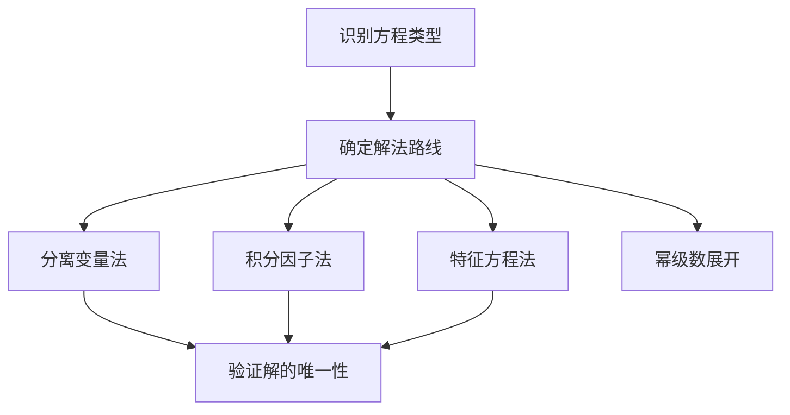

# [[微分方程]]

> 常微分方程

#数学

---
## 一阶微分方程类型与解法

### 1. 可分离变量方程

- **标准形式**：$$\dfrac{dy}{dx} = f(x)g(y)$$
- **解法**：$$\int \frac{dy}{g(y)} = \int f(x)dx + C$$
- **应用案例**：放射性衰变$\frac{dN}{dt}=-\lambda N$
- 注：**如果结果中左边是 ln|y|或者 ln|x|，请务必把右边的 C 变成 ln|C|**

### 2. 齐次方程

- **判定条件**：齐次方程$$\dfrac{dy}{dx} = f(\dfrac{y}{x})$$
- **解法**：令$u=\dfrac{y}{x}$→ 可分离变量
- **典型例题**：解$$\dfrac{dy}{dx}=\dfrac{y^2-xy}{x^2}$$

### 3. 一阶线性方程

- **标准形式**：$$\dfrac{dy}{dx} + P(x)y = Q(x)$$
- **通解公式**：
  $$ y = e^{-\int P(x)dx}\left[\int Q(x)e^{\int P(x)dx}dx + C\right] $$
- **工程应用**：RC 电路$RC\frac{dV}{dt}+V=V_0$

### 4. 伯努利方程

- **变形技巧**：$\frac{dy}{dx} + P(x)y = Q(x)y^n$ → 令$z=y^{1-n}$

---

### 高阶线性微分方程

#### 1. 解的结构理论

- **叠加原理**：若$y_1,y_2$是解 →$C_1y_1+C_2y_2$是解
- **Wronsky 行列式**：判断解线性无关性
  $$ W(y_1,y_2) = \begin{vmatrix} y_1 & y_2 \\ y_1' & y_2' \end{vmatrix} \neq 0 $$
也可以看特征根判定需要补$x^n$

  > 特解系数定，通解随意
  > 不要去~~扣特解成立范围的牛角尖~~

- 当题目给出了同一个方程的三个解（$y_1,y_2,y_3$），可以分别写成：$$\begin{cases}y_1=y^*+C_1 y_H\\y_2=y^*+C_2 y_H\\y_3=y^*+C_3y_H\end{cases}$$ 若需要求其**通解**，只需要相减得 n 倍的$y_H$；再从其中任意一个包含特解$y^*$的解出发，构造通解

> 所谓**通解（General Solution）**，记为$y_H$
>
> - 是指包含所有可能解的表达式；
> - 含有与方程阶数相同的任意常数（比如二阶方程有两个独立的任意常数 **$C1​,C2​$** ）；
> - 描述的是整个解族。

> **特解（Particular Solution）**，一般记为$y^*$或者$y_P$
>
> - 是通解中的一个具体解；
> - 是通过给定初始条件确定了任意常数之后的结果。

#### 2. 常系数齐次方程

- **特征方程法**：$y'' + py' + qy = 0$ → $r^2 + pr + q = 0$
  - 两实根 $r_1\neq r_2$：$y=C_1e^{r_1x}+C_2e^{r_2x}$
  - 重根 $r$：$y=(C_1+C_2x)e^{rx}$ 对于高阶的，同理扩展
  - 共轭复根 $\alpha\pm i\beta$：$y=e^{\alpha x}(C_1\cos\beta x+C_2\sin\beta x)$

#### 3. 非齐次方程特解法

| $f(x)$                            | 特解                              |
| --------------------------------- | --------------------------------- |
| $e^{kx}$                          | $y^*=Ae^{kx}$                     |
| $P_n(x)$                          | $y^*=Q_{n}(x)$                    |
| $\sin\omega x$ 或 $\cos \omega x$ | $y^*=A\sin\omega x+B\cos\omega x$ |
| $e^{kx}\pm P_(n)$                 | $y^*=Ae^{kx}\pm Q_{n}(x)$         |
| $e^{kx}P_{n}(x)$                  | $y^*=Ae^{kx}Q_n(x)$               |

加减乘
**先把特解的待定系数定下来了再去求通解**
**初值问题一定要带回去**

- 加入最后解方程的特解前最终要有个$x^k, k$的取值由特征根重数确定
- n 阶方程如果不是 IVP（Initial Value Problem，初值问题）那就有 n 个积分产生的任意常数$C$，这些常数如果不加以确定，他就是通解。如果需要确定常数，建议一边算，一边固定常数。
- **参数变异法**（通用方法）：
  $$ y_p = -y_1\int \frac{y_2 f}{W}dx + y_2\int \frac{y_1 f}{W}dx $$

#### 4. 欧拉方程（Eular Equation）

- **标准形式**：$$x^2y'' + pxy' + qy = 0$$
- **解法**：令$x=e^t$转化为常系数方程

#### 5. 可降解的高阶微分方程

三种常见类型：

- 不显含 $y$ 的方程：$y''=f(x,y')$ ，令 $p(x)=y'(x)$，方程退化为一阶微分方程： $p'=f(x,p$)
- 不显含 $x$ 的方程：$y''=f(y,y')$，令 $p(y)=y'$，根据链式求导法则，$\dfrac{d^2 y}{dx^2}=\dfrac{dp}{dx}=\dfrac{dp}{dy} \cdot \dfrac{dy}{dx}=p\dfrac{dp}{dy}$ 退化为一阶微分方程
- $y^(n)=f(x)$：没什么好多说的，积分就行

---

## 微分方程组求解

### 线性常系数方程组

**矩阵解法**：$\mathbf{Y}' = A\mathbf{Y}$ → 求矩阵指数$e^{At}$

- **物理实例**：耦合弹簧振动系统
  $$\begin{cases} m_1x_1'' = -k_1x_1 + k_2(x_2-x_1) \\ m_2x_2'' = -k_2(x_2-x_1) \end{cases}$$

### 非线性方程组的数值解优化

在平衡点$(x_0,y_0)$处泰勒展开：
$$ \frac{d}{dt}\begin{pmatrix} \Delta x \\ \Delta y \end{pmatrix} = J(x*0,y*0)\begin{pmatrix} \Delta x \\ \Delta y \end{pmatrix} $$
  $J$为雅可比矩阵。
（这招在[[数学物理方法_顾樵]]）里头有

---

### 特殊函数与级数解法

#### 1. 幂级数解法

- **勒让德方程**：$(1-x^2)y'' - 2xy' + n(n+1)y = 0$
- **贝塞尔方程**：$x^2y'' + xy' + (x^2-n^2)y = 0$

#### 2. 施图姆-刘维尔理论

- 标准形式：$$\frac{d}{dx}\left[p(x)\frac{dy}{dx}\right] + [\lambda w(x)-q(x)]y = 0$$
- 正交性：$$\int_a^b y_m(x)y_n(x)w(x)dx = 0 \quad (m\neq n)$$

---

### 物理建模案例库

#### 1. 机械振动系统

- **自由振动**：$mx'' + cx' + kx = 0$
  - 临界阻尼条件：$c^2=4mk$
- **受迫振动**：$mx'' + kx = F_0\cos\omega t$
  - 共振条件：$\omega = \sqrt{k/m}$

#### 2. 电路系统

- **RLC 电路**：$L\frac{d^2Q}{dt^2} + R\frac{dQ}{dt} + \frac{1}{C}Q = V(t)$

#### 3. 热传导方程

- 一维热传导：$\frac{\partial u}{\partial t} = \alpha \frac{\partial^2 u}{\partial x^2}$

### 解题方法论

---

### **八、易错点警示**

1. **变量代换错误**：齐次方程中忘记令$u=\frac{y}{x}$
2. **特解形式误设**：$f(x)$含齐次解时未乘$x$
3. **初始条件遗漏**：振动问题中未确定相位角
4. **收敛域忽视**：级数解法中未讨论收敛半径
