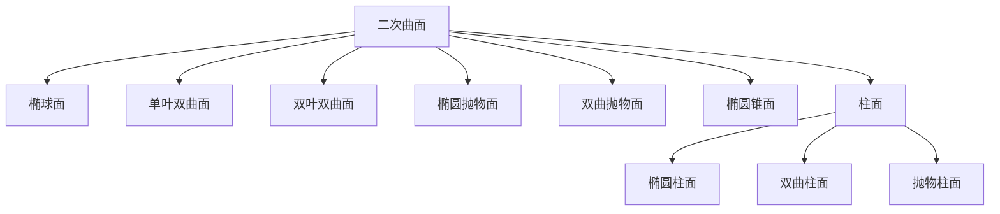

# [[曲面]]

> 曲面是空间中由连续运动的动线（母线）形成的轨迹，可通过三元方程 $F(x,y,z)=0$ 或参数方程表示 。

#数学 
## 二次曲面类型（共9种）  

1. 柱面

2. 双曲抛物面  
方程：$z = \dfrac{x^2}{a^2} - \frac{y^2}{b^2}$  
特点：鞍形曲面，又称马鞍面 。

3. 椭圆锥面  
方程：$\dfrac{x^2}{a^2} + \frac{y^2}{b^2} = \frac{z^2}{c^2}$  
特点：顶点在原点，锥面沿z轴扩展 。

4. 椭圆柱面  
方程：$\dfrac{x^2}{a^2} + \frac{y^2}{b^2} = 1$  
特点：母线平行于z轴的柱面 。

5. 双曲柱面  
方程：$\dfrac{x^2}{a^2} - \frac{y^2}{b^2} = 1$  
特点：母线平行于z轴的双曲柱面 。

6. 抛物柱面  
方程：$y = ax^2$ 或 $z = ax^2$  
特点：母线平行于坐标轴的抛物柱面 。

---

## 公式与推导  
### 曲面法向量  
对于隐式曲面 $F(x,y,z)=0$，其法向量为[[梯度]]：  
$$
\vec{n} = \nabla F = \left( \frac{\partial F}{\partial x}, \frac{\partial F}{\partial y}, \frac{\partial F}{\partial z} \right)
$$  
**推导**：法向量方向与曲面切线方向垂直，梯度方向即函数增长最快方向，故垂直于等值面 。

### 曲面面积计算  
若曲面由 $z = f(x,y)$ 表示，则面积元素为：  
$$
dS = \sqrt{1 + \left( \frac{\partial f}{\partial x} \right)^2 + \left( \frac{\partial f}{\partial y} \right)^2 } \, dx\,dy
$$  
总表面积：$S = \iint_D dS$

---

## 例题解析  
### 例题1：椭球面法向量  
求椭球面 $\frac{x^2}{4} + \frac{y^2}{9} + \frac{z^2}{16} = 1$ 在点 $(1, 1, 2)$ 处的法向量。  
**解**：  
定义 $F(x,y,z) = \frac{x^2}{4} + \frac{y^2}{9} + \frac{z^2}{16} - 1$，则  
$$
\nabla F = \left( \frac{x}{2}, \frac{2y}{9}, \frac{z}{8} \right)
$$  
代入点 $(1, 1, 2)$，得法向量 $\vec{n} = \left( \frac{1}{2}, \frac{2}{9}, \frac{1}{4} \right)$

---

## 多元微积分关系  
1. **曲面积分**：用于计算物理量（如电通量、质量）在曲面上的分布，公式：  
   $$
   \iint_S f(x,y,z) \, dS = \iint_D f(\vec{r}(u,v)) \cdot \left\| \frac{\partial \vec{r}}{\partial u} \times \frac{\partial \vec{r}}{\partial v} \right\| \, du\,dv
   $$  
2. **高斯公式**：将体积分与曲面积分关联：  
   $$
   \iiint_V (\nabla \cdot \vec{F}) \, dV = \iint_S \vec{F} \cdot \hat{n} \, dS
   $$  
3. **斯托克斯公式**：联系曲线积分与曲面积分  

---

## 可视化建议  
### Mermaid 分类图  

