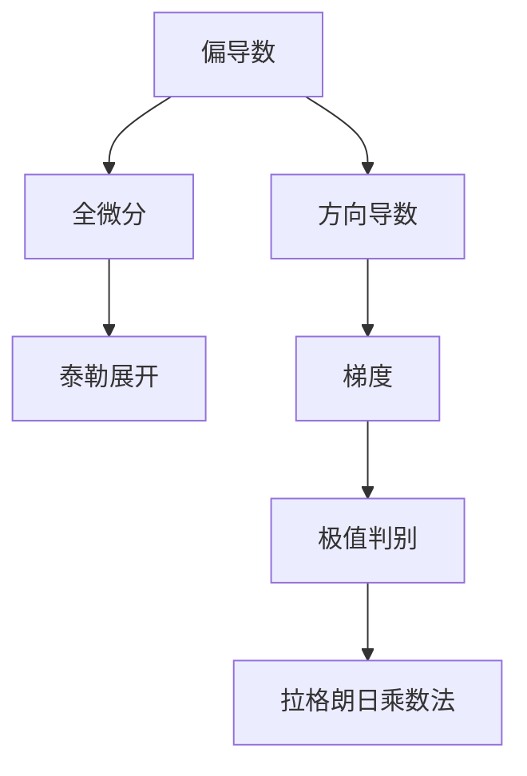

### **核心概念目录**
1. 向量代数  
2. 空间平面与直线方程  
3. 曲面与曲线方程  
4. 二次曲面分类  
5. 坐标变换  

---

### **1. 向量代数**
#### **定义**
- **向量**：具有大小和方向的量，记作$\vec{a}$或$\mathbf{a}$
- **关键操作**：线性运算、点积、叉积、混合积

#### **公式体系**
| 运算类型 | 公式                                                                        | 几何意义    |
| ---- | ------------------------------------------------------------------------- | ------- |
| 点积   | $\vec{a} \cdot \vec{b} = \|\vec{a}\|\|\vec{b}\|\cos\theta$                | 投影关系    |
| 叉积   | $\vec{a} \times \vec{b} = \|\vec{a}\|\|\vec{b}\|\sin\theta \cdot \vec{n}$ | 法向量生成   |
| 混合积  | $[\vec{a}\ \vec{b}\ \vec{c}] = (\vec{a} \times \vec{b}) \cdot \vec{c}$    | 平行六面体体积 |

#### **方向判定**
- **右手定则**：叉积方向判定（四指→拇指→垂直方向）
- **共面性判断**：混合积为零则三向量共面

#### **例题**
求过点$A(1,2,3)$且垂直于向量$\vec{n}=(2,-1,1)$的平面方程：  
**解**：利用点积性质得$2(x-1)-(y-2)+(z-3)=0$

---
以下是基于同济大学《高等数学（下册）》"多元函数微分学"核心概念的系统梳理，结合物理应用场景的深度拆解：

---

### **1. 多元函数基本概念**
#### **定义与几何表示**
- **n维点集**：$\mathbf{x}=(x_1,...,x_n) \in \mathbb{R}^n$
- **二元函数可视化**：
  - 等值线图：$f(x,y)=c$（地形图中的等高线）
  - 三维曲面：$z=f(x,y)$（如马鞍面$z=x^2-y^2$）

#### **物理意义**
- 标量场（如温度场$T(x,y,z)$）
- 势函数（如重力势能$U(x,y,z)$）

---

### **2. 偏导数与全微分**
#### **核心定义**
| 概念  | 数学表达                                                                                                | 物理对应                                         |
| --- | --------------------------------------------------------------------------------------------------- | -------------------------------------------- |
| 偏导数 | $\frac{\partial f}{\partial x_i} = \lim_{h\to0}\frac{f(\mathbf{x}+h\mathbf{e}_i)-f(\mathbf{x})}{h}$ | 方向响应（如热流方向导数）                                |
| 全微分 | $df = \sum_{i=1}^n \frac{\partial f}{\partial x_i}dx_i$                                             | 微小变化量（如功的计算$dW=\mathbf{F}\cdot d\mathbf{r}$） |

#### **几何解释**
- 偏导数：曲面与坐标平面交线的斜率
- 全微分：切平面方程$z-z_0=f_x(x_0,y_0)(x-x_0)+f_y(x_0,y_0)(y-y_0)$

---

### **3. 复合函数求导（链式法则）**
#### **核心公式**
- 单变量链式：$$\frac{dz}{dt}=\frac{\partial z}{\partial x}\frac{dx}{dt}+\frac{\partial z}{\partial y}\frac{dy}{dt}$$
- 多变量链式：
 $$\dfrac{\partial z}{\partial u} = \dfrac{\partial z}{\partial x}\dfrac{\partial x}{\partial u} + \dfrac{\partial z}{\partial y}\dfrac{\partial y}{\partial u}$$

#### **物理应用**
- 哈密顿力学中的广义坐标变换
- 流体力学中的物质导数$\dfrac{D}{Dt}=\dfrac{\partial}{\partial t}+\mathbf{v}\cdot\nabla$

---

### **4. 方向导数与梯度**
#### **关键概念**
- **方向导数**：
  $$ D_{\mathbf{u}}f = \nabla f \cdot \mathbf{u} = \|\nabla f\|\cos\theta$$
- **梯度性质**：
  - 指向函数增长最快方向
  - 等值面的法向量（如电场$\mathbf{E}=-\nabla V$）

#### **典型计算**
求$f(x,y)=x^2y$在点$(1,2)$沿$\mathbf{v}=(3,4)$的方向导数：  
1. 归一化：$\mathbf{u}=(\frac{3}{5},\frac{4}{5})$  
2. 计算梯度：$\nabla f=(2xy,x^2)\big|_{(1,2)}=(4,1)$  
3. 点积：$D_{\mathbf{u}}f=4\cdot\frac{3}{5}+1\cdot\frac{4}{5}=\frac{16}{5}$

---

### **5. 多元函数极值**
#### **判别方法**
1. 找驻点：解$\nabla f=0$
2. 黑塞矩阵判定：
   $$ H = \begin{bmatrix}
   f_{xx} & f_{xy} \\
   f_{yx} & f_{yy}
   \end{bmatrix} $$
   - $det(H)>0$且$f_{xx}>0$ → 极小值
   - $det(H)>0$且$f_{xx}<0$ → 极大值
   - $det(H)<0$ → 鞍点

#### **拉格朗日乘数法**
约束优化问题：
$$\mathcal{L}(x,y,\lambda) = f(x,y) - \lambda g(x,y)$$
物理应用：约束系统平衡条件（如悬链线问题）

---

### **6. 泰勒公式与近似计算**
#### **二元函数泰勒展开**
$$ f(x,y) \approx f(a,b) + f_x(a,b)(x-a) + f_y(a,b)(y-b) + \frac{1}{2!}\big[f_{xx}(a,b)(x-a)^2 + 2f_{xy}(a,b)(x-a)(y-b) + f_{yy}(a,b)(y-b)^2\big]  $$

#### **误差分析**
- 线性近似：$\Delta z \approx dz$（如热膨胀估算）
- 二次项：分析稳定性（如势能曲面）

---

### **概念关联图**

---

### **物理应用案例**
**案例1：电场强度计算**  
已知电势$V(x,y,z)=x^2y-yz^3$，求电场$\mathbf{E}$：  
$$ \mathbf{E} = -\nabla V = -(2xy, x^2-z^3, -3yz^2) $$

**案例2：热传导方程**  
温度场$T(x,y,t)$满足：
$$ \frac{\partial T}{\partial t} = \alpha \left(\frac{\partial^2 T}{\partial x^2} + \frac{\partial^2 T}{\partial y^2}\right) $$

---

### **常见误区警示**
1. 偏导数与全导数的混淆（如$\frac{df}{dx} \neq \frac{\partial f}{\partial x}$）
2. 链式法则漏项（特别是隐函数求导时）
3. 极值判定时忽略$det(H)=0$的临界情况

---

### **推荐练习**
1. 证明$u(x,t)=\frac{1}{\sqrt{t}}e^{-x^2/4t}$满足热传导方程
2. 用拉格朗日乘数法求点到平面的最短距离
3. 分析函数$f(x,y)=x^3+y^3-3xy$的所有临界点性质

建议结合以下工具深化理解：
- MATLAB符号计算（`syms`, `diff`, `gradient`）
- GeoGebra三维绘图观察极值点特征
- Wolfram Alpha验证高阶偏导数计算