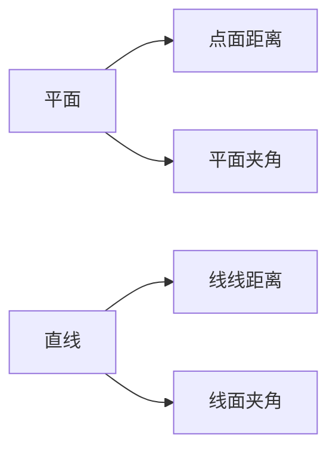
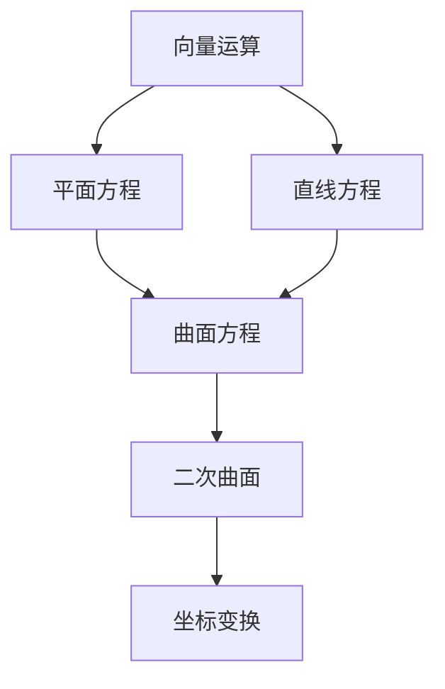
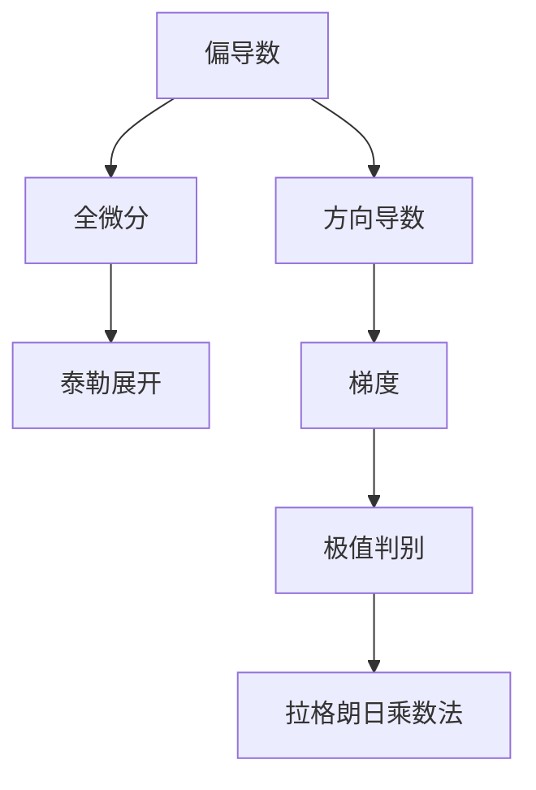

### **核心概念目录**
1. 向量代数  
2. 空间平面与直线方程  
3. 曲面与曲线方程  
4. 二次曲面分类  
5. 坐标变换  

---

### **1. 向量代数**
#### **定义**
- **向量**：具有大小和方向的量，记作$\vec{a}$或$\mathbf{a}$
- **关键操作**：线性运算、点积、叉积、混合积

#### **公式体系**
| 运算类型 | 公式                                                                        | 几何意义    |
| ---- | ------------------------------------------------------------------------- | ------- |
| 点积   | $\vec{a} \cdot \vec{b} = \|\vec{a}\|\|\vec{b}\|\cos\theta$                | 投影关系    |
| 叉积   | $\vec{a} \times \vec{b} = \|\vec{a}\|\|\vec{b}\|\sin\theta \cdot \vec{n}$ | 法向量生成   |
| 混合积  | $[\vec{a}\ \vec{b}\ \vec{c}] = (\vec{a} \times \vec{b}) \cdot \vec{c}$    | 平行六面体体积 |

#### **方向判定**
- **右手定则**：叉积方向判定（四指→拇指→垂直方向）
- **共面性判断**：混合积为零则三向量共面

#### **例题**
求过点$A(1,2,3)$且垂直于向量$\vec{n}=(2,-1,1)$的平面方程：  
**解**：利用点积性质得$2(x-1)-(y-2)+(z-3)=0$

---

### **2. 空间平面与直线方程**
#### **方程形式**
| 类型 | 方程表达式 | 参数说明 |
|------|------------|----------|
| 平面一般式 | $Ax+By+Cz+D=0$ | $\vec{n}=(A,B,C)$为法向量 |
| 直线对称式 | $\frac{x-x_0}{m}=\frac{y-y_0}{n}=\frac{z-z_0}{p}$ | 方向向量$\vec{s}=(m,n,p)$ |

#### **几何关系**

#### **可视化建议**
- 动态演示：GeoGebra中展示平面与直线的交点求解过程
- 教材参考：同济高数P125图7-15的平面截距式示意图

---

### **3. 曲面与曲线方程**
#### **核心概念**
- **柱面**：准线+母线方向（如$x^2+y^2=R^2$）
- **旋转曲面**：平面曲线绕轴旋转（如$y^2+z^2=e^x$）
- **空间曲线**：一般式$\begin{cases}F(x,y,z)=0\\G(x,y,z)=0\end{cases}$

#### **参数方程示例**
螺旋线：
$$\begin{cases}
x = R\cos t \\
y = R\sin t \\
z = kt 
\end{cases}$$

---

### **4. 二次曲面分类**
#### **标准方程表**
| 曲面类型 | 标准方程 | 特征 |
|----------|----------|------|
| 椭球面 | $\frac{x^2}{a^2}+\frac{y^2}{b^2}+\frac{z^2}{c^2}=1$ | 有界封闭 |
| 双曲面 | $\frac{x^2}{a^2}+\frac{y^2}{b^2}-\frac{z^2}{c^2}=1$ | 鞍形结构 |
| 抛物面 | $z=\frac{x^2}{a^2}+\frac{y^2}{b^2}$ | 开口方向性 |

#### **截痕法**
通过坐标平面截取曲面得到判别曲线：
- 椭圆、双曲线或抛物线组合

---

### **5. 坐标变换**
#### **一般步骤**
1. 平移变换：$\begin{cases}x=x'+h\\y=y'+k\\z=z'+l\end{cases}$
2. 旋转变换：通过正交矩阵$R$实现

#### **应用场景**
- 化简二次曲面方程
- 解决[[惯性张量]]等问题

---

### **概念网络**

---

### **典型例题**
**题目**：将曲面$2x^2+2y^2+3z^2+4xy=1$通过旋转标准化  
**解法**：
1. 写成矩阵形式$\mathbf{r}^T A \mathbf{r}=1$
2. 求特征值得主轴方向
3. 转化为标准椭球面方程

---

### **扩展链接**
- [[雅可比矩阵]]：曲线坐标系下的微分关系
- [[曲率计算]]：空间曲线的局部性质分析
- [[正交补空间]]：向量空间的几何分解

建议结合教材中以下资源深化理解：
1. 同济高数P142"二次曲面分类表"
2. 配套习题7.6中的曲面作图题
3. 利用MATLAB绘制参数曲面（如`fsurf(@(u,v) u.*sin(v),...)`）

---
以下是基于同济大学《高等数学（下册）》"多元函数微分学"核心概念的系统梳理，结合物理应用场景的深度拆解：

---

### **1. 多元函数基本概念**
#### **定义与几何表示**
- **n维点集**：$\mathbf{x}=(x_1,...,x_n) \in \mathbb{R}^n$
- **二元函数可视化**：
  - 等值线图：$f(x,y)=c$（地形图中的等高线）
  - 三维曲面：$z=f(x,y)$（如马鞍面$z=x^2-y^2$）

#### **物理意义**
- 标量场（如温度场$T(x,y,z)$）
- 势函数（如重力势能$U(x,y,z)$）

---

### **2. 偏导数与全微分**
#### **核心定义**
| 概念  | 数学表达                                                                                                | 物理对应                                         |
| --- | --------------------------------------------------------------------------------------------------- | -------------------------------------------- |
| 偏导数 | $\frac{\partial f}{\partial x_i} = \lim_{h\to0}\frac{f(\mathbf{x}+h\mathbf{e}_i)-f(\mathbf{x})}{h}$ | 方向响应（如热流方向导数）                                |
| 全微分 | $df = \sum_{i=1}^n \frac{\partial f}{\partial x_i}dx_i$                                             | 微小变化量（如功的计算$dW=\mathbf{F}\cdot d\mathbf{r}$） |

#### **几何解释**
- 偏导数：曲面与坐标平面交线的斜率
- 全微分：切平面方程$z-z_0=f_x(x_0,y_0)(x-x_0)+f_y(x_0,y_0)(y-y_0)$

---

### **3. 复合函数求导（链式法则）**
#### **核心公式**
- 单变量链式：$$\frac{dz}{dt}=\frac{\partial z}{\partial x}\frac{dx}{dt}+\frac{\partial z}{\partial y}\frac{dy}{dt}$$
- 多变量链式：
 $$\dfrac{\partial z}{\partial u} = \dfrac{\partial z}{\partial x}\dfrac{\partial x}{\partial u} + \dfrac{\partial z}{\partial y}\dfrac{\partial y}{\partial u}$$

#### **物理应用**
- 哈密顿力学中的广义坐标变换
- 流体力学中的物质导数$\dfrac{D}{Dt}=\dfrac{\partial}{\partial t}+\mathbf{v}\cdot\nabla$

---

### **4. 方向导数与梯度**
#### **关键概念**
- **方向导数**：
  $$ D_{\mathbf{u}}f = \nabla f \cdot \mathbf{u} = \|\nabla f\|\cos\theta$$
- **梯度性质**：
  - 指向函数增长最快方向
  - 等值面的法向量（如电场$\mathbf{E}=-\nabla V$）

#### **典型计算**
求$f(x,y)=x^2y$在点$(1,2)$沿$\mathbf{v}=(3,4)$的方向导数：  
1. 归一化：$\mathbf{u}=(\frac{3}{5},\frac{4}{5})$  
2. 计算梯度：$\nabla f=(2xy,x^2)\big|_{(1,2)}=(4,1)$  
3. 点积：$D_{\mathbf{u}}f=4\cdot\frac{3}{5}+1\cdot\frac{4}{5}=\frac{16}{5}$

---

### **5. 多元函数极值**
#### **判别方法**
1. 找驻点：解$\nabla f=0$
2. 黑塞矩阵判定：
   $$ H = \begin{bmatrix}
   f_{xx} & f_{xy} \\
   f_{yx} & f_{yy}
   \end{bmatrix} $$
   - $det(H)>0$且$f_{xx}>0$ → 极小值
   - $det(H)>0$且$f_{xx}<0$ → 极大值
   - $det(H)<0$ → 鞍点

#### **拉格朗日乘数法**
约束优化问题：
$$\mathcal{L}(x,y,\lambda) = f(x,y) - \lambda g(x,y)$$
物理应用：约束系统平衡条件（如悬链线问题）

---

### **6. 泰勒公式与近似计算**
#### **二元函数泰勒展开**
$$ f(x,y) \approx f(a,b) + f_x(a,b)(x-a) + f_y(a,b)(y-b) + \frac{1}{2!}\big[f_{xx}(a,b)(x-a)^2 + 2f_{xy}(a,b)(x-a)(y-b) + f_{yy}(a,b)(y-b)^2\big]  $$

#### **误差分析**
- 线性近似：$\Delta z \approx dz$（如热膨胀估算）
- 二次项：分析稳定性（如势能曲面）

---

### **概念关联图**

---

### **物理应用案例**
**案例1：电场强度计算**  
已知电势$V(x,y,z)=x^2y-yz^3$，求电场$\mathbf{E}$：  
$$ \mathbf{E} = -\nabla V = -(2xy, x^2-z^3, -3yz^2) $$

**案例2：热传导方程**  
温度场$T(x,y,t)$满足：
$$ \frac{\partial T}{\partial t} = \alpha \left(\frac{\partial^2 T}{\partial x^2} + \frac{\partial^2 T}{\partial y^2}\right) $$

---

### **常见误区警示**
1. 偏导数与全导数的混淆（如$\frac{df}{dx} \neq \frac{\partial f}{\partial x}$）
2. 链式法则漏项（特别是隐函数求导时）
3. 极值判定时忽略$det(H)=0$的临界情况

---

### **推荐练习**
1. 证明$u(x,t)=\frac{1}{\sqrt{t}}e^{-x^2/4t}$满足热传导方程
2. 用拉格朗日乘数法求点到平面的最短距离
3. 分析函数$f(x,y)=x^3+y^3-3xy$的所有临界点性质

建议结合以下工具深化理解：
- MATLAB符号计算（`syms`, `diff`, `gradient`）
- GeoGebra三维绘图观察极值点特征
- Wolfram Alpha验证高阶偏导数计算

---
好的，我们来系统整理一下二重积分、三重积分、第一/二类曲线积分和第一/二类曲面积分的核心算法、特点以及它们之间的关键联系。理解这些关联对于掌握多元积分学和场论至关重要。

**核心思想：** 所有这些积分本质上是将一个函数（标量场或向量场）在某个几何区域（平面区域、空间区域、曲线、曲面）上进行“累加”。区别在于被积对象的类型（标量还是向量）和积分区域的几何特性及维度。

---

## 一、 积分概览

| 积分类型        | 被积函数                               | 积分区域     | 积分元素 (dS/dA/dV)               | 物理意义 (常见)    | 结果类型 |
| :---------- | :--------------------------------- | :------- | :---------------------------- | :----------- | :--- |
| **二重积分**    | 标量函数 `f(x, y)`                     | 平面区域 `D` | `dA` (面积元)                    | 平面薄片质量、区域面积  | 标量   |
| **三重积分**    | 标量函数 `f(x, y, z)`                  | 空间区域 `Ω` | `dV` (体积元)                    | 空间物体质量、体积    | 标量   |
| **第一类曲线积分** | 标量函数 `f(x, y, z)`                  | 空间曲线 `L` | `ds` (弧长元)                    | 曲线形物体质量、曲线长度 | 标量   |
| **第二类曲线积分** | 向量场 `F(x, y, z) = P i + Q j + R k` | 空间曲线 `L` | `dr = (dx, dy, dz)`           | 力场沿曲线做功、环量   | 标量   |
| **第一类曲面积分** | 标量函数 `f(x, y, z)`                  | 空间曲面 `Σ` | `dS` (面积元)                    | 曲面形物体质量、曲面面积 | 标量   |
| **第二类曲面积分** | 向量场 `F(x, y, z) = P i + Q j + R k` | 空间曲面 `Σ` | `dS * n = (dydz, dzdx, dxdy)` | 向量场通过曲面的通量   | 标量   |

**关键点：**
1.  **积分元素 (`d?`) 的本质**：
    *   **二重积分 `dA` / 三重积分 `dV` / 第一类曲线积分 `ds` / 第一类曲面积分 `dS`**： 这些元素代表积分区域的几何度量（面积、体积、弧长、曲面面积）。积分结果是**标量**。
    *   **第二类曲线积分 `dr` / 第二类曲面积分 `dS * n`**： 这些元素带有方向性。`dr` 是曲线的切向量元素，`dS * n` 是曲面的法向量元素（`n` 是单位法向量）。积分结果也是**标量**（点积的结果）。

2.  **第一类 vs 第二类**：
    *   **第一类积分**： 积分**标量函数**在**无向几何区域**上。只关心函数值在区域上的分布和区域本身的大小。
    *   **第二类积分**： 积分**向量场**在**有向几何区域**上。关心向量场与区域方向（曲线的切线方向或曲面的法线方向）的相互作用（点积）。

---

## 二、 核心计算方法

1.  **二重积分 (∬ᵦ f(x, y) dA)**
    *   **思想**： 将平面区域 `D` 投影到坐标轴上。
    *   **关键步骤**：
        *   **确定积分区域 `D`**： 画出图形，明确边界曲线。
        *   **选择积分次序**： 先 `y` 后 `x` 或先 `x` 后 `y`。取决于 `D` 的边界表示哪种方式更简单（X型区域或Y型区域）。
        *   **确定积分限**： 外层积分限是常数（投影范围），内层积分限通常是外层变量的函数（边界曲线方程）。
        *   **化为累次积分计算**： `∬ᵦ f(x, y) dA = ∫ₐᵇ dx ∫_{φ₁(x)}^{φ₂(x)} f(x, y) dy` 或 `∫꜀ᵈ dy ∫_{ψ₁(y)}^{ψ₂(y)} f(x, y) dx`
    *   **极坐标变换**： 当区域 `D` 是圆、环、扇形或其一部分时常用。`dA = r dr dθ`, `x = r cosθ`, `y = r sinθ`。

2.  **三重积分 (∭Ω f(x, y, z) dV)**
    *   **思想**： 将空间区域 `Ω` 投影到坐标平面上。
    *   **关键步骤**：
        *   **确定积分区域 `Ω`**： 想象或画图，明确边界曲面。
        *   **选择投影面与积分次序**： 常用投影到 `xy` 平面（先 `z` 后 `xy`）、`xz` 平面（先 `y` 后 `xz`）或 `yz` 平面（先 `x` 后 `yz`）。选择依据是边界曲面表示哪种方式最简单。
        *   **确定积分限**：
            *   外层二重积分：`Ω` 在投影面上的投影区域 `D`。
            *   内层单积分：`z` (或 `y` 或 `x`) 在 `Ω` 内随投影点 `(x, y)` (或 `(x, z)`, `(y, z)`) 的变化范围，由上下边界曲面方程确定。
        *   **化为累次积分计算**： 例如投影到 `xy` 平面：`∭Ω f(x, y, z) dV = ∬ᵦ [∫_{z₁(x,y)}^{z₂(x,y)} f(x, y, z) dz] dA`，其中 `∬ᵦ ... dA` 是对投影区域 `D` 的二重积分。
    *   **柱坐标变换**： 当 `Ω` 的投影是圆域，且边界曲面用 `z = g(r, θ)` 表示方便时。`dV = r dr dθ dz`, `x = r cosθ`, `y = r sinθ`, `z = z`。
    *   **球坐标变换**： 当 `Ω` 是球体、锥体或其一部分时。`dV = ρ² sinφ dρ dφ dθ`, `x = ρ sinφ cosθ`, `y = ρ sinφ sinθ`, `z = ρ cosφ`。

3.  **第一类曲线积分 (∫ₗ f(x, y, z) ds)**
    *   **思想**： 将曲线 `L` 用参数方程表示，转化为定积分。
    *   **关键步骤**：
        *   **参数化曲线**： 将曲线 `L` 表示为 `r(t) = (x(t), y(t), z(t))`, `t ∈ [α, β]`。
        *   **计算弧长微元 `ds`**： `ds = |r'(t)| dt = √[(dx/dt)² + (dy/dt)² + (dz/dt)²] dt`。
        *   **代入被积函数**： 将 `x(t)`, `y(t)`, `z(t)` 代入 `f(x, y, z)`。
        *   **化为定积分计算**： `∫ₗ f ds = ∫ₐᵝ f(x(t), y(t), z(t)) * √[(dx/dt)² + (dy/dt)² + (dz/dt)²] dt`。
    *   **特例 - 平面曲线**： 若 `L` 在 `xy` 平面且可表示为 `y = y(x)`, `x ∈ [a, b]`，则 `ds = √[1 + (dy/dx)²] dx`，积分变为 `∫ₐᵇ f(x, y(x)) √[1 + (y')²] dx`。类似地，若 `x = x(y)`。

4.  **第二类曲线积分 (∫ₗ F · dr = ∫ₗ P dx + Q dy + R dz)**
    *   **思想**： 同样需要参数化曲线，并将方向信息（切向量）融入 `dx, dy, dz`。
    *   **关键步骤**：
        *   **参数化曲线并确定方向**： 将曲线 `L` 表示为 `r(t) = (x(t), y(t), z(t))`, `t` 从 `α` 到 `β`。**曲线的方向由参数 `t` 增大的方向决定。**
        *   **计算微分 `dx, dy, dz`**： `dx = (dx/dt) dt`, `dy = (dy/dt) dt`, `dz = (dz/dt) dt`。
        *   **代入被积表达式**： 将 `x(t)`, `y(t)`, `z(t)`, `dx/dt`, `dy/dt`, `dz/dt` 代入 `P dx + Q dy + R dz`。
        *   **化为定积分计算**： `∫ₗ F · dr = ∫ₐᵝ [P(x(t), y(t), z(t))*(dx/dt) + Q(x(t), y(t), z(t))*(dy/dt) + R(x(t), y(t), z(t))*(dz/dt)] dt`。
    *   **格林公式 (Green's Theorem) (平面)**： 如果 `L` 是**平面**上**封闭**的**分段光滑**的**简单**曲线（不自交），`D` 是 `L` 围成的区域，`P(x, y)`, `Q(x, y)` 在 `D` 上具有一阶连续偏导数，则：
        `∮ₗ P dx + Q dy = ∬ᵦ (∂Q/∂x - ∂P/∂y) dA`
        *   作用： 将复杂的平面第二类曲线积分（环量）转化为相对容易计算的二重积分（旋度在区域上的积分）。**方向：`L` 取正向（逆时针）。**
    *   **斯托克斯公式 (Stokes' Theorem) (空间)**： 如果 `Σ` 是**空间**中**分片光滑**的**有向**曲面，边界是**分段光滑**的**有向**闭曲线 `L`（`L` 的方向与 `Σ` 的法向量方向满足右手法则），`F = P i + Q j + R k` 的分量在包含 `Σ` 的区域内有连续偏导数，则：
        `∮ₗ F · dr = ∬Σ (∇ × F) · dS = ∬Σ (∇ × F) · n dS`
        *   作用： 将空间第二类曲线积分（环量）转化为第二类曲面积分（旋度场通过曲面的通量）。**是格林公式在空间的推广。**

5.  **第一类曲面积分 (∬Σ f(x, y, z) dS)**
    *   **思想**： 将曲面 `Σ` 投影到坐标平面上（通常是 `xy` 平面），转化为投影区域上的二重积分。
    *   **关键步骤 (投影到 `xy` 平面为例)**：
        *   **曲面显式表示**： 将 `Σ` 表示为 `z = z(x, y)`, `(x, y) ∈ D_{xy}`（`D_{xy}` 是 `Σ` 在 `xy` 平面上的投影区域）。
        *   **计算面积微元 `dS`**： `dS = √[1 + (∂z/∂x)² + (∂z/∂y)²] dA_{xy}`。
        *   **代入被积函数**： 将 `z(x, y)` 代入 `f(x, y, z)`。
        *   **化为二重积分计算**： `∬Σ f dS = ∬ᵈˣʸ f(x, y, z(x, y)) * √[1 + (zₓ)² + (z_y)²] dA_{xy}`。
    *   **参数化方法**： 若曲面由参数方程 `r(u, v) = (x(u, v), y(u, v), z(u, v))`, `(u, v) ∈ D` 给出，则：
        `dS = |rᵤ × rᵥ| dudv`
        `∬Σ f dS = ∬ᵈ f(x(u, v), y(u, v), z(u, v)) * |rᵤ × rᵥ| dudv`

6.  **第二类曲面积分 (∬Σ F · dS = ∬Σ F · n dS = ∬Σ P dy dz + Q dz dx + R dx dy)**
    *   **思想**： 将向量场 `F` 与曲面的**有向**面积元 `n dS` 点积。通常需要投影到坐标平面上计算。
    *   **关键步骤 (分项投影法)**：
        *   **确定曲面方向 (法向量 `n`)**： 这是计算的关键，决定了积分的正负号。
        *   **投影计算**：
            *   **计算 ∬Σ R dx dy**： 将 `Σ` 投影到 `xy` 平面得区域 `D_{xy}`。若 `Σ` 的法向量与 `z` 轴夹角为 `γ`，则 `dx dy = cosγ dS`。如果 `Σ` 可以表示为 `z = z(x, y)`, `(x, y) ∈ D_{xy}`，则：
                `∬Σ R(x, y, z) dx dy = ∬ᵈˣʸ R(x, y, z(x, y)) * [sign(cosγ)] dA_{xy}`
                *   `sign(cosγ)` 由曲面方向决定：**上侧（法向量与 `z` 轴正向锐角）取 `+`，下侧取 `-`**。若曲面方程是 `z = z(x, y)`，则上侧对应 `cosγ > 0`，下侧对应 `cosγ < 0`。
            *   **计算 ∬Σ P dy dz**： 类似地投影到 `yz` 平面 (`D_{yz}`)。方向：**前侧（法向量与 `x` 轴正向锐角）取 `+`，后侧取 `-`**。
            *   **计算 ∬Σ Q dz dx**： 类似地投影到 `zx` 平面 (`D_{zx}`)。方向：**右侧（法向量与 `y` 轴正向锐角）取 `+`，左侧取 `-`**。
        *   **相加**： `∬Σ F · dS = ∬Σ P dy dz + ∬Σ Q dz dx + ∬Σ R dx dy`
    *   **合一投影法 (显式方程)**： 如果曲面 `Σ` 表示为 `z = z(x, y)`, 取**上侧**，则：
        `∬Σ F · dS = ∬ᵈˣʸ [ -P(x, y, z) * ∂z/∂x - Q(x, y, z) * ∂z/∂y + R(x, y, z) ] dA_{xy}`
        (若取下侧，则结果取负号。其他方向类似推导)。
    *   **高斯公式 (散度定理) (Gauss's Theorem / Divergence Theorem)**： 如果 `Σ` 是**空间**中**封闭**的**分片光滑**的**有向**曲面（外侧为正），`Ω` 是 `Σ` 围成的空间区域，`F = P i + Q j + R k` 的分量在 `Ω` 内有连续偏导数，则：
        `∯Σ F · dS = ∭Ω (∇ · F) dV`
        *   作用： 将第二类曲面积分（向量场通过封闭曲面的通量）转化为三重积分（散度场在区域内的积分）。**是散度在数学上的精确表述。**

---

## 三、 关键知识点关联

1.  **计算方法的统一框架：参数化与投影**
    *   **曲线积分 (第一、二类)**： 核心是**曲线的参数化**。第一类用弧长微元 `ds`，第二类用切向量微元 `dr`。
    *   **曲面积分 (第一、二类)**： 核心是**曲面的显式表示或参数化**。第一类用标量面积微元 `dS`，第二类用有向面积微元 `dS * n`。计算通常依赖于**投影**到某个坐标平面转化为二重积分。
    *   **二重积分**： 是计算曲面积分（投影后）和格林公式结果的基础。
    *   **三重积分**： 是计算高斯公式结果的基础。

2.  **第一类积分之间的联系：几何度量**
    *   **二重积分 ∬ᵦ 1 dA** = 平面区域 `D` 的面积。
    *   **三重积分 ∭Ω 1 dV** = 空间区域 `Ω` 的体积。
    *   **第一类曲线积分 ∫ₗ 1 ds** = 曲线 `L` 的长度。
    *   **第一类曲面积分 ∬Σ 1 dS** = 曲面 `Σ` 的面积。
    *   它们都计算的是积分区域的某种**几何度量**（面积、体积、长度），被积函数 `f` 可以看作该几何度量上的**密度**（如质量密度、电荷密度）。

3.  **第二类积分之间的联系：向量场与微积分基本定理的高维推广**
    *   **格林公式**： 建立了**平面**上**第二类曲线积分 (环量)** 与**二重积分 (旋度)** 的联系。`(∂Q/∂x - ∂P/∂y)` 是向量场 `F = P i + Q j` 的**旋度 (k分量)**。
    *   **斯托克斯公式**： 推广了格林公式到**空间**。建立了**空间第二类曲线积分 (环量)** 与**第二类曲面积分 (旋度通量)** 的联系。`∇ × F` 是向量场 `F` 的**旋度**。
    *   **高斯公式**： 建立了**第二类曲面积分 (通量)** 与**三重积分 (散度)** 的联系。`∇ · F` 是向量场 `F` 的**散度**。
    *   **核心联系**： 格林、斯托克斯、高斯公式都是**微积分基本定理**（`∫ₐᵇ F'(x) dx = F(b) - F(a)`）在**高维空间**的推广形式。它们揭示了**区域内部的某种导数（旋度、散度）的积分**等于**函数（向量场）在区域边界上的积分**。
        *   格林、斯托克斯： 边界曲线积分 = 内部旋度积分 (二维/三维)。
        *   高斯： 边界曲面积分 = 内部散度积分 (三维)。

4.  **第一类与第二类积分之间的转换**
    *   第二类曲线积分可以通过方向信息（单位切向量 `T`）与第一类曲线积分联系： `∫ₗ F · dr = ∫ₗ (F · T) ds`。物理上，`F · T` 是力场沿曲线切向的分量，做功等于切向分量沿路径的累积。
    *   第二类曲面积分可以通过方向信息（单位法向量 `n`）与第一类曲面积分联系： `∬Σ F · dS = ∬Σ (F · n) dS`。物理上，`F · n` 是向量场穿过曲面的法向分量，通量等于法向分量在曲面上的累积。

5.  **坐标变换的统一性**
    *   计算多重积分和曲面积分时，常利用**坐标变换 (极坐标、柱坐标、球坐标)** 来简化被积函数或积分区域。变换的核心是计算**Jacobian行列式**的绝对值，它给出了坐标变换下面积元或体积元的缩放因子：
        *   二重积分 (极坐标)： `|J| = r`
        *   三重积分 (柱坐标)： `|J| = r`
        *   三重积分 (球坐标)： `|J| = ρ² sinφ`
        *   曲面参数化： `dS = |rᵤ × rᵥ| dudv`，其中 `|rᵤ × rᵥ|` 本质上是参数变换的 Jacobian (度量曲面的拉伸)。

---

## 四、 总结与注意事项

1.  **明确类型**： 做题时首先要明确是哪种积分？被积对象是标量还是向量？积分区域是平面、空间体、曲线还是曲面？是第一类还是第二类？
2.  **方向性**： **第二类积分（曲线和曲面积分）的方向至关重要**，直接影响结果的符号。计算前必须明确指定或根据题意判断方向（正向、外侧、上侧等）。
3.  **计算方法选择**：
    *   曲线积分： 首选**参数化法**。
    *   曲面积分： 首选**显式方程投影法**或**参数化法**。
    *   封闭曲线/曲面： **优先考虑格林公式、斯托克斯公式、高斯公式**，看条件是否满足（封闭、方向正确、偏导数连续）。这些公式往往能极大简化计算。
4.  **物理背景**： 理解积分对应的物理意义（质量、功、通量、环量等）有助于加深对概念和公式的理解。
5.  **练习**： 通过大量练习不同类型的题目来熟练掌握各种计算技巧和公式的应用条件。

理解这些积分各自的定义、计算方法以及它们之间通过格林公式、斯托克斯公式、高斯公式建立的内在联系，是掌握多元积分学和向量分析的关键。它们共同构成了描述物理场（如力场、电磁场、流体场）在空间区域、曲线和曲面上行为的强大数学工具。