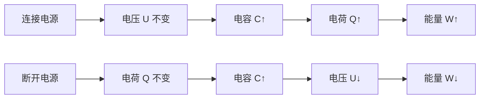

# [[电容和电容器]]

> 电容器：由两个相互绝缘的导体构成的储存电荷和电能的器件
> 电容：表征电容器储存电荷能力的物理量

#物理学 #电磁学

## 公式

$$
C=\frac{Q}{\Delta U}
$$

其中：

- $Q$是电容器单块极板上的电荷量的绝对值
- $\Delta U$是两极板之间的电势差
- 单位：库伦（C）/伏特（V）=法拉（F），1F 太大了，所以还有辅助单位：
  微法（$\mu F=10^{-6}F$）；皮法（$pF=10^{-6}\mu F=10^{-12}F$）

## 物理意义

电容是电容器的一个性能参数，反映导体系统储存电荷的效率，与几何结构和介质相关；
电容器则是电工学中一个重要的电器件，常用在交流电路和电子线路中。

## 相关分析

电容器两极板之间的**作用力**：
--

$$
\sigma=\frac{Q}{S},E=\frac{\sigma}{2\epsilon_{r}}=\frac{U}{d} \implies F= 
$$
电容器储存的**能量密度和电场能**：
--
$$
w_e = \frac{1}{2}\epsilon_0 E^2 \qquad W = \frac{1}{2}CV^2 = \frac{Q^2}{2C}
$$
- 充电过程是外力克服电场力做功，电能储存在电场中

方向判断
--
- **电场方向**：正极板→负极板（与电势降低方向一致）
- **[[右手螺旋定则]]**：用于判断充电/放电电流产生的磁场方向（见[[电流的磁场]]）
- **能量流动**：坡印廷矢量 ( $\mathbf{S} = \mathbf{E} \times \mathbf{H}$ ) 方向（需结合[[电磁波传播]]）

## 典型的电容器的电容

### 同心球壳电容器

内球壳半径为$r$，外球壳半径为$R$的电容器：

$$
C = 4\pi\epsilon_0 \epsilon_r \left( \dfrac{rR}{R-r} \right)
$$

证明：

扩展：当小$\\lim_{ r \to 0},C=$

### 平行板电容器

$$
C=\dfrac{\epsilon_{0}\epsilon_{r}S}{d}
$$

### 圆柱形电容器

内柱半径为$r$，外柱半径为$R$，长度为$L$ 的电容器：

$$
C = \frac{2\pi\epsilon_0 \epsilon_r L}{\ln\left( \dfrac{R}{r} \right)}
$$

### 插入电介质板之后的分析



## 可视化建议
   ```mermaid
   graph LR
     A[正极板] -->|E场线| B[负极板]
     B -->|介质极化| C[束缚电荷]
   ```
## 例题与解答

## 相关概念和扩展
- [[电位移矢量]]
- [[边界条件]]
- [[麦克斯韦方程组]]
- **高频特性**：实际电容器存在[[寄生参数]]（如等效串联电阻ESR）

## 参考来源

[[电磁学通论_钟锡华]]
