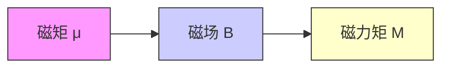

# [[磁力矩]]

> 磁力矩是磁场对载流线圈产生的力矩，使其发生转动的趋势。常见于电动机、指南针等物理现象。

#物理学 #电磁学
## 定义

磁力矩（Magnetic Torque）是磁场对通电线圈施加的力矩，其大小取决于：

- 线圈的[[磁矩]] $\mu$（Magnetic Dipole Moment）
- 磁场强度 $B$
- 磁矩与磁场方向的夹角 $\theta$

## 公式

$$
\vec{M} = \vec{\mu} \times \vec{B}
$$

$$
|M| = \mu B \sin\theta
$$

其中：

- $\mu = N I S$（$N$为线圈匝数，$I$为电流，$S$为面积）
- θ 为磁矩方向与磁场方向的夹角

## 方向判断：右手螺旋定则

1. 用右手四指环绕电流方向；
2. 大拇指指向磁矩方向；
3. 磁力矩方向垂直于磁矩与磁场构成的平面。

## 物理意义

- 当 θ = 90° 时，磁力矩最大；
- 当 θ = 0° 或 180° 时，磁力矩为 0；
- 磁力矩使线圈趋向于磁矩与磁场方向一致。

## 例题解析

**题目**：在匀强磁场中，有两个平面线圈，面积 S₁ = 2S₂，电流 I₁ = 2I₂，求最大磁力矩之比。

**解析**：

1. 最大磁力矩发生在 θ = 90°，此时：
   $$
   M_{\text{max}} = \mu B = N I S B
   $$
2. 假设两线圈匝数相同（N₁ = N₂），则：
   $$
   \frac{M_1}{M_2} = \frac{I_1 S_1}{I_2 S_2} = \frac{2I_2 \cdot 2S_2}{I_2 \cdot S_2} = 4
   $$
   **答案**：最大磁力矩之比为 **4:1**

## 相关概念

- [[磁矩]]
- [[安培力]]
- [[右手螺旋定则]]
- [[磁场对载流线圈的作用]]

## 可视化建议

