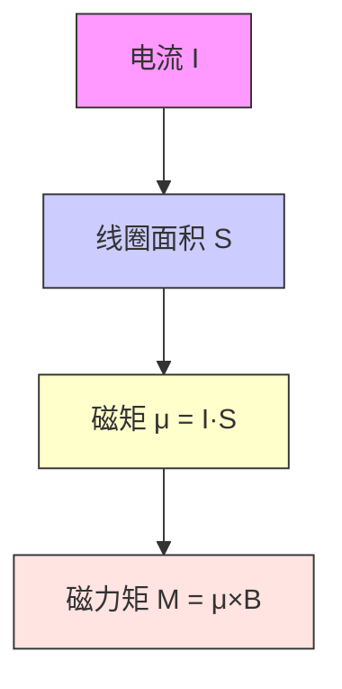

# [[磁矩]]

> 磁矩是描述载流线圈或磁体磁性强弱与方向的物理量，类比于[[电偶极矩]]。

#物理学 #电磁学

## 定义

磁矩（Magnetic Dipole Moment）是一个矢量，**表示线圈的磁性强度和方向**：

$$
\vec{\mu} = N I \vec{S}
$$

其中：

- $N$：线圈匝数
- $I$：电流
- $S$：线圈面积（矢量方向由右手螺旋定则确定）

## 公式

- 大小：$\mu = N I S$
- 方向：右手螺旋定则（四指绕电流方向，大拇指指向 $\mu$ 方向）

## 物理意义

- 磁矩越大，线圈在磁场中受的磁力矩越大；
- 磁矩方向决定了线圈的“北极”；
- 磁矩与磁场方向一致时最稳定。

## 例题解析

**题目**：半径为 $R_1$ 和 $R_2$ 的两个半圆弧与直径的两小段构成的通电线圈 abcda，放在磁感应强度为 B 的均匀磁场中，B 平行于线圈所在平面，求磁矩和磁力矩。

**解析**：

1. **磁矩**：

   - 线圈总面积：$S = πR_1^2 + πR_2^2$（两个半圆弧构成完整圆）
   - 磁矩：$\mu = I \cdot S = I \pi (R_1^2 + R_2^2)$

2. **磁力矩**：
   - 因 B 平行于线圈平面，θ = 90°（磁矩方向垂直于线圈平面）
   - 磁力矩：$M = \mu B \sin\theta = I \pi (R_1^2 + R_2^2) B$

**答案**：

- 磁矩：$\mu = I \pi (R_1^2 + R_2^2)$
- 磁力矩：$M = I \pi (R_1^2 + R_2^2) B$

## 相关概念

- [[磁力矩]]
- [[右手螺旋定则]]
- [[磁场对载流线圈的作用]]
- [[电偶极矩]]

## 可视化建议

