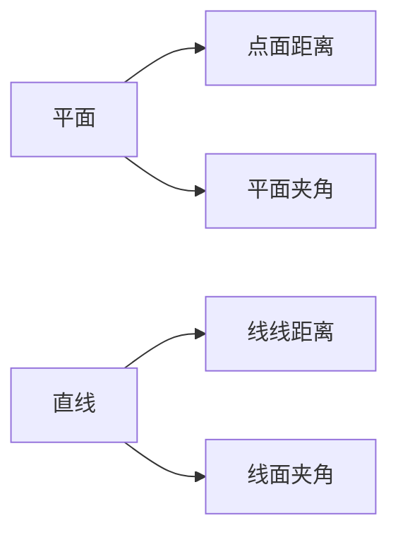
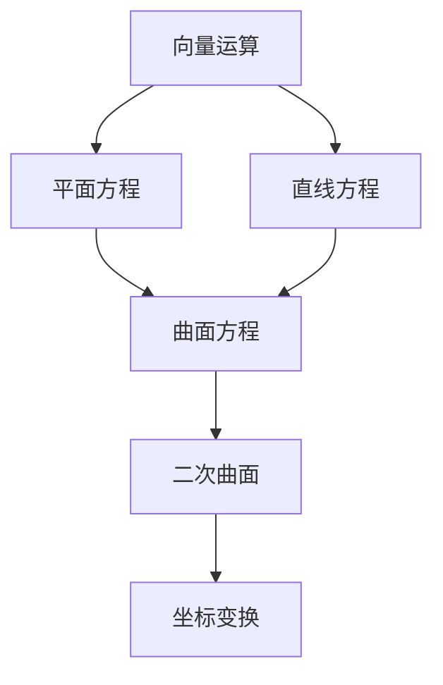

#数学 

## 空间平面与直线方程
#### 方程形式

| 类型    | 方程表达式                                                | 参数说明                         |
| ----- | ---------------------------------------------------- | ---------------------------- |
| 平面一般式 | $Ax+By+Cz+D=0$                                       | $\vec{n}=(A,B,C)$为法向量，一个方程就行 |
| 直线对称式 | $\dfrac{x-x_0}{m}=\dfrac{y-y_0}{n}=\dfrac{z-z_0}{p}$ | 方向向量$\vec{s}=(m,n,p)$，两个方程联立 |

#### 几何关系

---

### 3. 曲面与曲线方程
#### 核心概念
- **柱面**：准线+母线方向（如$x^2+y^2=R^2$）
- **旋转曲面**：平面曲线绕轴旋转（如$y^2+z^2=e^x$）
- **空间曲线**：一般式$\begin{cases}F(x,y,z)=0\\G(x,y,z)=0\end{cases}$

#### 参数方程示例
螺旋线：
$$\begin{cases}
x = R\cos t \\
y = R\sin t \\
z = kt 
\end{cases}$$

---

### 4. 二次曲面分类
#### 标准方程表

| 曲面类型 | 标准方程                                                   | 特征    |
| ---- | ------------------------------------------------------ | ----- |
| 椭球面  | $\dfrac{x^2}{a^2}+\dfrac{y^2}{b^2}+\dfrac{z^2}{c^2}=1$ | 有界封闭  |
| 双曲面  | $\dfrac{x^2}{a^2}+\dfrac{y^2}{b^2}-\dfrac{z^2}{c^2}=1$ | 鞍形结构  |
| 抛物面  | $z=\dfrac{x^2}{a^2}+\dfrac{y^2}{b^2}$                  | 开口方向性 |

#### 截痕法
通过坐标平面截取曲面得到判别曲线：
- 椭圆、双曲线或抛物线组合

---

### **5. 坐标变换**
#### **一般步骤**
1. 平移变换：$\begin{cases}x=x'+h\\y=y'+k\\z=z'+l\end{cases}$
2. 旋转变换：通过正交矩阵$R$实现

#### **应用场景**
- 化简二次曲面方程

---

### **概念网络**

---

### 典型例题
**题目**：将曲面$2x^2+2y^2+3z^2+4xy=1$通过旋转标准化  
**解法**：
1. 写成矩阵形式$\mathbf{r}^T A \mathbf{r}=1$
2. 求特征值得主轴方向
3. 转化为标准椭球面方程

### 曲线的投影

>以该空间曲线为准线，与平面的法向量平行的直线为母线所产生的柱面与那个平面的交线

**例题**：
求空间曲线 $\Gamma:\begin{cases} x + y + z = 0, \\ x^2 + 2y^2 + 3z^2 = 1 \end{cases}$ 在平面 $x - 2y + 2z = 10$ 上的投影曲线方程。

析
--
有同学说我平常一直做的朝那三个坐标平面投影的曲线方程啊，就把曲线方程随便消个元然后再和对应的坐标平面联立就好了，怎么突然朝空间中任意平面投影的方程捏？这其实就是知其然不知其所以然了。刚刚说的做题方法只是一个技巧，没有一般性！

但是架不住好用啊：往平行于 $xOy$ 面的投影就把一个方程里 $z$ 消掉，再和对应平面联立

要解决这个问题，自然是回归定义：什么是空间曲线对于一个平面的投影曲线？以该空间曲线为准线，与平面的法向量平行的直线为母线所产生的柱面与那个平面的交线。

解
--
所给平面的一个法向量 $\vec{n} = (1, -2, 2)$。为了求投影曲线方程，先求出以空间曲线为准线，生成方向与 $\vec{n}$ 平行的柱面方程。设柱面上一点 $P(x, y, z)$ 由所给空间曲线上一点 $P_0(x_0, y_0, z_0)$ 生成，则 $\overrightarrow{PP_0}$ 与 $\vec{n}$ 平行，于是可以列出方程组
$$
\begin{cases}
x_0 + y_0 + z_0 = 0, \\
x_0^2 + 2y_0^2 + 3z_0^2 = 1, \\
\dfrac{x_0 - x}{1} = \dfrac{y_0 - y}{-2} = \dfrac{z_0 - z}{2}
\end{cases}
$$
消去 $(x_0, y_0, z_0)$ 可得该柱面的方程为（P.S 消的时候先用第三个式子=t写出$x_{0}=f_{x}\dots$）
$$(y+z)^2 + 2(2x + 3y + 2z)^2 + 3(2x + 2y + z)^2 = 1$$
从而所求投影曲线方程为
$$
\begin{cases}
(y+z)^2 + 2(2x + 3y + 2z)^2 + 3(2x + 2y + z)^2 = 1, \\
x - 2y + 2z = 10.
\end{cases}
$$