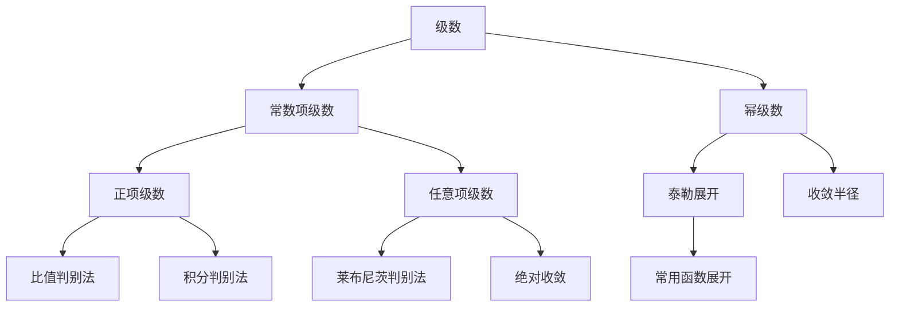
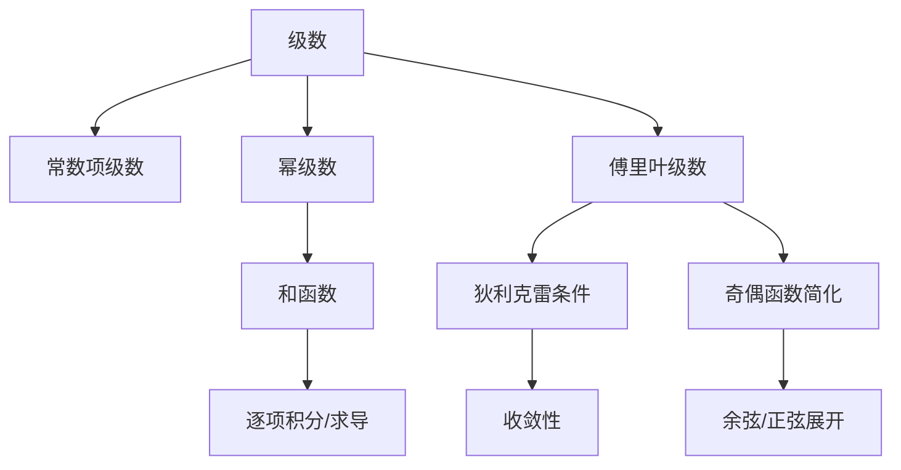

# [[级数|级数 Series]]

#数学

---

## 一、基本概念

### 1. 级数的定义

设数列 $\{a_n\}$，其无穷级数定义为：

$$
\sum_{n=1}^{\infty} a_n = a_1 + a_2 + a_3 + \cdots
$$

- **部分和**：$S_n = a_1 + a_2 + \cdots + a_n$
- **收敛性：若 $\lim_{n \to \infty} S_n = S$ 存在（为常数），则称级数收敛，和为 $S$；否则发散**
- **收敛的必要条件：$\lim_{ n \to \infty }a_{n}=0$**；余项和趋于0

---

## 二、常数项级数分类、判别法和性质

### 1. 正项级数

所有项 $a_n \geq 0$，常用判别法：

- **比较判别法**：若 $0 \leq a_n \leq b_n$ 且 $\sum_{n=0}^{\infty} b_n$ 收敛，则 $\sum_{n=0}^{\infty} a_n$ 收敛。强收敛，弱收敛；弱发散，强发散
- **比较判别法的极限版本**：考察$\lim_{ n \to \infty } \dfrac{a_{n}}{b_{n}}=l$
	- 若$l=C$，$\sum_{n=0}^{\infty} a_n$和$\sum_{n=0}^{\infty} b_n$敛散性相同；
	- 若 $l \rightarrow 0, \sum_{n=0}^{\infty}b_{n}=C$（即收敛），则$\sum_{n=0}^{\infty} a_n$收敛
	- 若 $l \rightarrow \infty, \sum_{n=0}^{\infty}b_{n}$发散，则$\sum_{n=0}^{\infty} a_n$发散
- **比值判别法（达朗贝尔 d' Alembert 判别法）**：设 $\lim_{n \to \infty} \frac{a_{n+1}}{a_n} = \rho$，则：
  - $\rho < 1$：收敛；
  - $\rho > 1$：发散；
  - $\rho = 1$：换一种。
- **根值判别法（柯西审敛法）**：设 $\lim_{n \to \infty} \sqrt[n]{a_n} = \rho$，结论同上。
- **积分判别法**：若 $f(x)$ 在 $[1, \infty)$ 上**连续、非负、单调递减**，且 $f(n) = a_n$，则 $\sum a_n$ 与 $\int_1^{\infty} f(x) dx$ 同敛散。

### 2. 任意项级数

项可正可负，常用判别法：

- **交错级数判别法（莱布尼茨定理）**：若 $a_n \geq 0$，**单调递减**且 $\lim_{n \to \infty} a_n = 0$，则 $\sum (-1)^{n+1} a_n$ 收敛。

> 若 $\sum |a_n|$ 收敛，则 $\sum a_n$ **绝对收敛**；
> 若 $\sum a_n$ 收敛但 $\sum |a_n|$ 发散，则为**条件收敛**。

### 3. 级数的性质

- 收 ± 收 = 收
- 收 × 收 = 收
- 发 ± 收/发 = 发
- 收敛级数加括号之后形成的新级数一定收敛；加减有限项同样不改变
- 乘一个非零常数不改变敛散性

---

## 三、幂级数与函数展开

### 1. 幂级数定义

形如：

$$
\sum_{n=0}^{\infty} a_n (x - x_0)^n
$$

在 $x = x_0$ 附近定义，其收敛域为某个区间 $|x - x_0| < R$，其中 $R$ 为收敛半径。

**阿贝尔定理（Abel's Law）**
--
如果级数$\sum_{n=0}^{\infty} a_nx^n$在$x=x_{0}\neq 0$处收敛，那么满足 $\lvert x\rvert<\lvert x_{0}\rvert$ 的所有 $x$ 使得这个幂函数绝对收敛；反之，如果级数$\sum_{n=0}^{\infty} a_nx^n$在$x=x_{0}\neq 0$处发散，那么满足 $\lvert x\rvert>\lvert x_{0}\rvert$ 的所有 $x$ 使得这个幂函数发散

> 一个常用的推论：若级数$\sum_{n=0}^{\infty} a_nx^n$在$x=x_{0}\neq 0$处条件收敛，那么，$x_{0}$ 为其收敛半径

### 2. 收敛半径计算

- **比值法**：
  $$
  R = \lim_{n \to \infty} \left| \frac{a_n}{a_{n+1}} \right|
  $$
- **根值法**：
  $$
  R = \frac{1}{\lim_{n \to \infty} \sqrt[n]{|a_n|}}
  $$

**边界点带进去算一下**

### 3. 幂级数的性质

- **连续性**：和函数在收敛区间内连续；
- **逐项可导**：导数级数收敛半径相同；
- **逐项可积**：积分级数收敛半径相同；
- **线性运算**得到的**新级数**的收敛域在两个区间的交集
- 相**乘**得到的**新级数**的收敛域是两个区间的交集，其系数为柯西乘积
- 相**除**得到的**新级数**的收敛域可能会**小得多**

### 4. 函数的幂级数展开（泰勒级数）

若函数 $f(x)$ 在 $x_0$ 处**任意阶可导**，则其泰勒级数为：

$$
f(x) = \sum_{n=0}^{\infty} \frac{f^{(n)}(x_0)}{n!} (x - x_0)^n
$$

- **麦克劳林级数**：$x_0 = 0$ 时的泰勒级数。

### 5. [[常见的展开和近似|常用函数的泰勒展开]]

| 函数               | 展开式                                                    | 收敛域                 |
| ---------------- | ------------------------------------------------------ | ------------------- |
| $e^x$            | $\sum_{n=0}^{\infty} \dfrac{x^n}{n!}$                  | $(-\infty, \infty)$ |
| $\sin x$         | $\sum_{n=0}^{\infty} \dfrac{(-1)^n x^{2n+1}}{(2n+1)!}$ | $(-\infty, \infty)$ |
| $\cos x$         | $\sum_{n=0}^{\infty} \dfrac{(-1)^n x^{2n}}{(2n)!}$     | $(-\infty, \infty)$ |
| $\ln(1+x)$       | $\sum_{n=1}^{\infty} \dfrac{(-1)^{n+1} x^n}{n}$        | $(-1, 1]$           |
| $\dfrac{1}{1-x}$ | $\sum_{n=0}^{\infty} x^n$                              | $x<1$               |
| $(1+x)^m$        | $\sum_{n=0}^{\infty} \binom{m}{n} x^n$                 | $-1<x<1$            |
| $\dfrac{1}{1+x}$ | $\sum_{n=0}^{\infty} (-1)^nx^n$                        | $-1<x< 1$           |
| $\arctan x$      | $\sum_{n=0}^{\infty} \dfrac{(-1)^n}{2n+1}x^{2n+1}$     | $(-\infty,+\infty)$ |

---

## 四、解题方法与步骤

### 1. **判断级数收敛性**

- **正项级数**：
  1. 优先考虑$p$级数判别法，$\sum_{n=0}^{\infty}{\dfrac{1}{n^p}}$,$p>1$时收敛，$p\leq1$ 时发散
  2. 尝试比值判别法或根值判别法；
  3. 若失效，尝试比较判别法（找已知收敛/发散的级数比较）；
  4. 使用积分判别法（适用于 $a_n = f(n)$ 且 $f(x)$ 易积分的情况）。
- **任意项级数**：
  1. 判断是否绝对收敛；
  2. 若不绝对收敛，尝试莱布尼茨判别法（针对交错级数）。

### 2. **幂级数收敛半径与收敛域**

- 计算收敛半径 $R$；
- 检查端点 $x = x_0 \pm R$ 处的敛散性（使用常数项级数判别法）。

### 3. **函数展开为幂级数**

- 直接法：求各阶导数代入泰勒公式；
- 间接法：利用已知展开式进行代数运算、求导、积分等操作。

### 4. **求和函数**

- 对幂级数逐项积分或求导，转化为已知函数形式；
- 利用微分方程法（适用于递推关系明显的级数）。

---

## 五、知识点关联图（Mermaid 格式）

---

## 六、典型例题与解法

### 1. 判断级数收敛性

**例题**：判断级数 $\sum_{n=1}^{\infty} \frac{n^2}{2^n}$ 的敛散性。

**解**：

- 使用比值判别法：
  $$
  \lim_{n \to \infty} \frac{(n+1)^2 / 2^{n+1}}{n^2 / 2^n} = \lim_{n \to \infty} \frac{(n+1)^2}{2n^2} = \frac{1}{2} < 1
  $$
- 结论：收敛。

---

### 2. 求幂级数的收敛半径

**例题**：求级数 $\sum_{n=1}^{\infty} \frac{x^n}{n}$ 的收敛半径与收敛域。

**解**：

- 比值法：
  $$
  R = \lim_{n \to \infty} \left| \frac{a_n}{a_{n+1}} \right| = \lim_{n \to \infty} \frac{n+1}{n} = 1
  $$
- 端点 $x = 1$：调和级数发散；
- 端点 $x = -1$：交错调和级数收敛；
- 收敛域：$[-1, 1)$

---

### 3. 函数展开为幂级数

**例题**：将 $f(x) = \frac{1}{(1-x)^2}$ 展开为 $x$ 的幂级数。

**解**：

- 已知 $\frac{1}{1-x} = \sum_{n=0}^{\infty} x^n$，对其求导：
  $$
  \frac{1}{(1-x)^2} = \frac{d}{dx} \left( \frac{1}{1-x} \right) = \sum_{n=1}^{\infty} n x^{n-1} = \sum_{n=0}^{\infty} (n+1) x^n
  $$
- 收敛域：$|x| < 1$

----

### 4. 一个有点烦的求和

求解这个级数：

$$
\sum_{n=1}^{\infty}(-1)^n\dfrac{n+1}{(2n+1)!}
$$

1. 🧠 第一步：观察结构

这是一个**交错级数**（因为有 $(-1)^n$），每一项的分子是线性表达式 $n+1$，分母是阶乘形式 $(2n+1)!$。

这类级数常与 **三角函数的泰勒展开** 有关，尤其是正弦和余弦函数，因为它们的泰勒展开中包含奇数次幂和对应的阶乘分母。

2. 🔍 第二步：回忆相关泰勒展开公式

我们先回顾一下：
- 正弦函数的麦克劳林展开为：

$$
\sin x = \sum_{n=0}^{\infty} \frac{(-1)^n}{(2n+1)!} x^{2n+1}
$$

- 这是唯一一个我知道的分母是$(2n+1)!$的

3. 📌 第三步：尝试拆分通项

我们将原式中的通项拆开：

$$
\sum_{n=1}^{\infty} (-1)^n \cdot \frac{n+1}{(2n+1)!}
= \sum_{n=1}^{\infty} (-1)^n \cdot \left( \frac{n}{(2n+1)!} + \frac{1}{(2n+1)!} \right)
= \sum_{n=1}^{\infty} (-1)^n \cdot \frac{n}{(2n+1)!} + \sum_{n=1}^{\infty} (-1)^n \cdot \frac{1}{(2n+1)!}
$$

我们分别记作：

$$
S_1 = \sum_{n=1}^{\infty} (-1)^n \cdot \frac{n}{(2n+1)!}, \quad
S_2 = \sum_{n=1}^{\infty} (-1)^n \cdot \frac{1}{(2n+1)!}
$$

4. 处理 $S_2$

我们从已知的正弦函数展开出发：

$$
\sin x = \sum_{n=0}^{\infty} \frac{(-1)^n}{(2n+1)!} x^{2n+1}
\Rightarrow \text{令 } x = 1 \text{ 得 } \sin 1 = \sum_{n=0}^{\infty} \frac{(-1)^n}{(2n+1)!}
$$

于是：

$$
\sum_{n=0}^{\infty} \frac{(-1)^n}{(2n+1)!} = \sin 1
\Rightarrow \sum_{n=1}^{\infty} \frac{(-1)^n}{(2n+1)!} = \sin 1 - \frac{(-1)^0}{1!} = \sin 1 - 1
$$

所以：
$$
S_2 = \sin 1 - 1
$$

5. 处理 $S_1$

我们考虑对 $\sin x$ 求导：

$$
\sin x = \sum_{n=0}^{\infty} \frac{(-1)^n}{(2n+1)!} x^{2n+1}
\Rightarrow \frac{d}{dx} \sin x = \cos x = \sum_{n=0}^{\infty} \frac{(-1)^n (2n+1)}{(2n+1)!} x^{2n}
= \sum_{n=0}^{\infty} \frac{(-1)^n}{(2n)!} x^{2n}
$$

但我们要的是形如 $\dfrac{n}{(2n+1)!}$ 的项。我们可以构造如下函数：

设：
$$
f(x) = \sum_{n=0}^{\infty} \frac{(-1)^n n}{(2n+1)!} x^{2n+1}
$$

然后令 $x = 1$，即可得到我们需要的级数。于是，我们想计算的是：

$$
f(1) = \sum_{n=0}^{\infty} \frac{(-1)^n n}{(2n+1)!}
$$

**注意**：
- 当 $n = 0$ 时，该项为 0，所以从 $n = 1$ 开始也无影响。
- 我们希望找到这个函数与 $\sin x$ 或 $\cos x$ 的关系。

6. 📐 将 $f(x)$ 表达成已知函数的组合

我们回到：

$$
f(x) = \sum_{n=0}^{\infty} \frac{(-1)^n n}{(2n+1)!} x^{2n+1}
$$
观察到：

$$
x \cdot \frac{d}{dx} \left( \frac{\sin x}{x} \right)
= \text{一种能生成 } \frac{n}{(2n+1)!} \text{ 类似结构的方法}
$$

现在看这个技巧性更强但非常有用的方法。

4. 🔍 使用 $\frac{\sin x}{x}$ 展开式

$$
\frac{\sin x}{x} = \sum_{n=0}^{\infty} \frac{(-1)^n}{(2n+1)!} x^{2n}
$$

对两边求导：

$$
\frac{d}{dx} \left( \frac{\sin x}{x} \right)
= \sum_{n=0}^{\infty} \frac{(-1)^n \cdot 2n}{(2n+1)!} x^{2n - 1}=2\sum_{n=0}^{\infty} \frac{(-1)^n \cdot n}{(2n+1)!} x^{2n - 1}
$$

乘上 $x$ 得：

$$
x \cdot \frac{d}{dx} \left( \frac{\sin x}{x} \right)
= 2\sum_{n=0}^{\infty} \frac{(-1)^n \cdot n}{(2n+1)!} x^{2n}
$$

令 $x = 1$：

$$
2\sum_{n=0}^{\infty} \frac{(-1)^n \cdot n}{(2n+1)!}
= \left. x \cdot \frac{d}{dx} \left( \frac{\sin x}{x} \right) \right|_{x=1}
$$

我们可以直接计算右边：

$$
\frac{\sin x}{x} = \sum_{n=0}^{\infty} \frac{(-1)^n}{(2n+1)!} x^{2n}
\Rightarrow \frac{d}{dx} \left( \frac{\sin x}{x} \right)
= \sum_{n=1}^{\infty} \frac{(-1)^n \cdot 2n}{(2n+1)!} x^{2n - 1}
$$

所以：

$$
x \cdot \frac{d}{dx} \left( \frac{\sin x}{x} \right)
= \sum_{n=1}^{\infty} \frac{(-1)^n \cdot 2n}{(2n+1)!} x^{2n}
\Rightarrow \text{令 } x = 1
\Rightarrow \sum_{n=1}^{\infty} \frac{(-1)^n \cdot 2n}{(2n+1)!}
= \left. x \cdot \frac{d}{dx} \left( \frac{\sin x}{x} \right) \right|_{x=1}
$$

7. 代入数值并化简

我们来计算右边表达式的值：

$$
\frac{d}{dx} \left( \frac{\sin x}{x} \right)
= \frac{x \cos x - \sin x}{x^2}
\Rightarrow x \cdot \frac{d}{dx} \left( \frac{\sin x}{x} \right)
= \frac{x \cos x - \sin x}{x}
$$

令 $x = 1$：

$$
\sum_{n=1}^{\infty} \frac{(-1)^n \cdot 2n}{(2n+1)!}
= \frac{1 \cdot \cos 1 - \sin 1}{1} = \cos 1 - \sin 1
$$

因此：

$$
\sum_{n=1}^{\infty} \frac{(-1)^n \cdot n}{(2n+1)!}
= \frac{1}{2} (\cos 1 - \sin 1)
$$

由于 $n = 0$ 项为 0，所以整个和为：

$$
\sum_{n=0}^{\infty} \frac{(-1)^n n}{(2n+1)!} = \frac{1}{2} (\cos 1 - \sin 1)
$$

- ✅ S1的最终结论：

$$
\boxed{
\sum_{n=0}^{\infty} \frac{(-1)^n n}{(2n+1)!} = \frac{1}{2} (\cos 1 - \sin 1)
}
$$

因此：
$$
S_1 = \sum_{n=1}^{\infty} \frac{(-1)^n n}{(2n+1)!} = \frac{1}{2}(\sin 1 - \cos 1) - \underbrace{\frac{(-1)^0 \cdot 0}{1!}}_{=0} = \frac{1}{2}(\sin 1 - \cos 1)
$$

8. 🎯 合并两部分

最终结果为：

$$
\sum_{n=1}^{\infty} (-1)^n \cdot \frac{n+1}{(2n+1)!}
= S_1 + S_2 = \frac{1}{2}(\sin 1 - \cos 1) + (\sin 1 - 1)
= \frac{3}{2}\sin 1 - \frac{1}{2}\cos 1 - 1
$$

-  ✅ 最终答案：

$$
\boxed{
\sum_{n=1}^{\infty} (-1)^n \cdot \frac{n+1}{(2n+1)!}
= \frac{3}{2}\sin 1 - \frac{1}{2}\cos 1 - 1
}
$$

---

## 七、傅里叶级数（Fourier Series）

### 1. 定义与标准形式

设函数 $f(x)$ 是定义在区间 $[-\pi, \pi]$ 上的周期函数（周期为 $2\pi$），其傅里叶级数展开为：

$$
f(x) =\frac{a_0}{2} + \sum_{n=1}^{\infty} \left( a_n \cos nx + b_n \sin nx \right)
$$

其中：

- **傅里叶系数**：
  $$
  a_0 = \frac{1}{\pi} \int_{-\pi}^{\pi} f(x) dx,\quad
  a_n = \frac{1}{\pi} \int_{-\pi}^{\pi} f(x) \cos nx dx,\quad
  b_n = \frac{1}{\pi} \int_{-\pi}^{\pi} f(x) \sin nx dx
  $$

### 2. 周期为 $2l$ 的傅里叶级数

若函数定义在区间 $[-l, l]$，周期为 $2l$，则展开为：

$$
f(x) \sim \frac{a_0}{2} + \sum_{n=1}^{\infty} \left( a_n \cos \frac{n\pi x}{l} + b_n \sin \frac{n\pi x}{l} \right)
$$

其中：

- **傅里叶系数**：
  $$
  a_0 = \frac{1}{l} \int_{-l}^{l} f(x) dx,\quad
  a_n = \frac{1}{l} \int_{-l}^{l} f(x) \cos \frac{n\pi x}{l} dx,\quad
  b_n = \frac{1}{l} \int_{-l}^{l} f(x) \sin \frac{n\pi x}{l} dx
  $$

### 3. **奇偶函数的傅里叶级数简化**

- 若 $f(x)$ 为偶函数：
  - 所有 $b_n = 0$，仅含余弦项；
  - 积分区间可简化为 $[0, \pi]$。
- 若 $f(x)$ 为奇函数：
  - 所有 $a_n = 0$，仅含正弦项；
  - 积分区间可简化为 $[0, \pi]$。

---

## 八、狄利克雷条件（Dirichlet Conditions）

若函数 $f(x)$ 在 $[-\pi, \pi]$ 上满足以下条件，则其傅里叶级数收敛到 $f(x)$ 的某个值：

1. **分段连续**：函数在区间内仅有**有限个第一类间断点**；
2. **分段光滑**：导数在区间内仅有**有限个第一类间断点**；
3. **周期延拓后连续**：若 $f(x)$ 在端点处不连续，需修正为左右极限的平均值。

- 这个条件比泰勒展开的条件第不少

### 收敛性结论：

- 在连续点 $x_0$ 处，傅里叶级数收敛到 $f(x_0)$；
- 在间断点 $x_0$ 处，收敛到：
  $$
  f(x_{0})=\frac{f(x_0^-) + f(x_0^+)}{2}
  $$

---

## 九、和函数（Sum Function）

### 1. 幂级数的和函数

设幂级数：

$$
S(x) = \sum_{n=0}^{\infty} a_n (x - x_0)^n
$$

其和函数 $S(x)$ 在收敛域内连续、可导、可积，且可通过**逐项求导或积分求和**。
- 积分**可能**使收敛端点性质改变；求导不变，所以保险起见如果来得及记得算一下

#### 常见技巧：

- **已知函数展开式代入**（如 $e^x, \sin x, \dfrac{1}{1-x}$）；
- **逐项积分/求导**：将复杂级数转化为已知函数；
- **微分方程法**：设 $S(x)$ 满足某微分方程，求解方程。

### 2. 傅里叶级数的和函数

傅里叶级数的和函数 $S(x)$ 是原函数 $f(x)$ 的周期延拓，满足：

- 在连续点处：$S(x) = f(x)$
- 在间断点处：$S(x) = \dfrac{f(x^-) + f(x^+)}{2}$

---

## 十、典型例题与解法

### 例题 1：傅里叶级数展开

**题目**：将函数 $f(x) = x$（定义在 $[-\pi, \pi]$）展开为傅里叶级数。

**解**：

1. 判断函数奇偶性：$f(x)$ 为奇函数，故所有 $a_n = 0$。
2. 计算 $b_n$：
   $$
   b_n = \dfrac{1}{\pi} \int_{-\pi}^{\pi} x \sin nx dx = \frac{2}{\pi} \int_{0}^{\pi} x \sin nx dx = \frac{2(-1)^{n+1}}{n}
   $$
3. 得到傅里叶级数：
   $$
   f(x) = \sum_{n=1}^{\infty} \frac{2(-1)^{n+1}}{n} \sin nx
   $$
4. 在 $x = \pi$ 处收敛到 $\dfrac{f(\pi^-) + f(\pi^+)}{2} = 0$

- 如果求解$a_{n}$或者$b_{n}$，$f(x)$可以直接采用最初的函数带入，积分仔细一点；先把$n$代掉

---

### 例题 2：幂级数求和

**题目**：求幂级数 $\sum_{n=1}^{\infty} \dfrac{x^n}{n(n+1)}$ 的和函数。

**解**：

1. 分解通项：
   $$
   \frac{1}{n(n+1)} = \frac{1}{n} - \frac{1}{n+1}
   $$
2. 将级数拆分为两部分：
   $$
   \sum_{n=1}^{\infty} \frac{x^n}{n(n+1)} = \sum_{n=1}^{\infty} \frac{x^n}{n} - \sum_{n=1}^{\infty} \frac{x^n}{n+1}
   $$
3. 利用已知展开式：
   $$
   \sum_{n=1}^{\infty} \frac{x^n}{n} = -\ln(1 - x),\quad
   \sum_{n=1}^{\infty} \frac{x^n}{n+1} = \frac{1}{x} \left( -\ln(1 - x) - x \right)
   $$
4. 合并得和函数：
   $$
   S(x) = -\ln(1 - x) - \left( \frac{-\ln(1 - x) - x}{x} \right) = \frac{(1 - x)\ln(1 - x) + x}{x}
   $$

-----

### 例题 3：傅里叶级数的另一种用法

---

## 五、知识点关联图（Mermaid 格式）

## 七、总结表格

| 类型       | 关键判别法                 | 物理意义                 |
| ---------- | -------------------------- | ------------------------ |
| 常数项级数 | 比值法、根值法、莱布尼茨法 | 描述序列总和的极限行为   |
| 幂级数     | 收敛半径法                 | 用无穷多项式逼近函数     |
| 泰勒级数   | 展开公式、间接法           | 函数局部线性化与近似计算 |
| 傅里叶级数 | 周期性                     | 周期函数拟合             |
