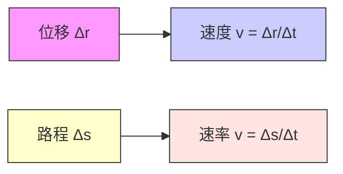

# [[速度和速率]]

> 速度和速率是描述物体运动快慢的核心概念，但二者有本质区别：**速度是矢量，速率是标量**。  
> 理解它们的定义、公式和物理意义，是掌握运动学的基础。

#物理学 

----

## 一、定义与公式

### 1. 速度（Velocity）
- **平均速度**：  
  $$
  \vec{v}_{\text{avg}} = \frac{\Delta \vec{r}}{\Delta t}
  $$
  其中 $\Delta \vec{r}$ 是位移矢量，$\Delta t$ 是时间间隔。

$$
  \vec{v} = \lim_{\Delta t \to 0} \frac{\Delta \vec{r}}{\Delta t} = \frac{d\vec{r}}{dt}
  $$  
  > 在笛卡尔坐标系中，速度可分解为：  
$$
  \vec{v} = v_x \hat{i} + v_y \hat{j} + v_z \hat{k} = \frac{dx}{dt} \hat{i} + \frac{dy}{dt} \hat{j} + \frac{dz}{dt} \hat{k}
$$

- **瞬时速度**：  
  $$
  \vec{v} = \lim_{\Delta t \to 0} \frac{\Delta \vec{r}}{\Delta t} = \frac{d\vec{r}}{dt}
  $$

- **物理意义**：  
  - 描述物体位置变化的快慢和方向；
  - 是矢量，既有大小也有方向。

---

### 2. 速率（Speed）
- **平均速率**：  
  $$
  v_{\text{avg}} = \frac{\text{路程 } s}{\Delta t}
  $$

- **瞬时速率**：  
  $$
  v = \lim_{\Delta t \to 0} \frac{\Delta s}{\Delta t} = \frac{ds}{dt}
  $$

- **物理意义**：  
  - 描述物体运动路径的快慢；
  - 是标量，只有大小，无方向。

---

## 二、关键区别

| 项目     | 速度                              | 速率                  |
| ------ | ------------------------------- | ------------------- |
| 类型     | 矢量                              | 标量                  |
| 公式     | $\vec{v} = \frac{d\vec{r}}{dt}$ | $v = \frac{ds}{dt}$ |
| 是否有方向  | 是                               | 否                   |
| 取决于    | 位移（起点→终点）                       | 实际路径长度              |
| 是否可能为零 | 是（如往返运动后回到原点）                   | 否（只要运动就有路程）         |

---

## 三、图示对比

